# Faq

**Source:** https://support.unitree.com/home/en/G1_developer/FAQ  
**Scraped:** 10306.110931071

---

## Does G1 support docking stations?

> No, Jetson ORIN NX will be built into the edu version 

## Jetson Orin Nx WIFI Configuration method

> ### AP Mode:
> 
>   1. ap schema creation with create_ap，github link：<https://github.com/oblique/create_ap>
> 

>     
>     
>     git clone https://github.com/oblique/create_ap
>     cd ./create_ap/
>     make install
> 
>   2. Install the necessary software
> 

>     
>     
>     sudo apt install -y hostapd dnsmasq network-manager
> 
> Connect to the wifi, whose name is MyAccessPoint
>     
>     
>     create_ap wlan0 eth0 MyAccessPoint
> 
> For other specific usage methods, please refer to:  
>  [https://gitcode.com/gh_mirrors/cr/create_ap/overview?utm_source=csdn_github_accelerator&isLogin=1](https://gitcode.com/gh_mirrors/cr/create_ap/overview?utm_source=csdn_github_accelerator&isLogin=1)
> 
> ### STA pattern:
> 
> STA mode is a common way to configure WIFI, there are many tutorials on the Internet, the following wpa_cli as an example  
>  Enter the dedicated console and select wlan0 by default
> 
> #### wap_cli Configure the WIFI mode
>     
>     
>     wpa_cli
> 
>   1. Add a network and get the network ID
> 

>     
>     
>     add_network
> 
>   2. After (1) get an ID number, let's say ID number is 1, then connect to your wifi
> 

>     
>     
>     set_network  1  ssid  “your wifi name”
> 
>   3. Set a password for the WIFI connection
> 

>     
>     
>     set_network  1  psk  “your wifi key”
> 
>   4. Enable WIFI
> 

>     
>     
>     enable_network 1
> 
>   5. Save WIFI information
> 

>     
>     
>     save_config
> 
>   6. Check wifi connection status
> 

>     
>     
>     status
> 
> Step 7 Quit
>     
>     
>     quit
> 
> #### nmcli Configures the WIFI mode
> 
> Some users discovered wpa. Procedure_If the cli is unavailable, you can use the nmcli to configure WIFI access.
> 
>   1. waln0 was enabled.
> 

>     
>     
>     sudo ifconfig wlan0 up
> 
>   2. Turn on the wireless card
> 

>     
>     
>     sudo nmcli radio wifi on
> 
>   3. Check whether wifi is enabled
> 

>     
>     
>     nmcli radio wifi
> 
>   4. Link wifi
> 

>     
>     
>     nmcli device wifi connect <SSID> password <password>

### After the G1 device is upgraded with the latest firmware ≥1.3.0, the Joint limt is abnormal and Transient Over Voltage is reported.

> The new firmware optimizes the joint calibration accuracy. The previous calibration accuracy does not meet the requirements and needs to be re-calibrated. 

### When the device is configuring the network, the network WiFi configuration fails.

> This problem is related to the wireless environment, especially when the exhibition and other places, the wireless environment is more complex, more interference. You can take the G1 device to a place with less interference and try a network configuration. 

### G1-29 DOF device, after unlocking the waist fixator (APP synchronously closes the waist lock switch), report the joint out-of-limit position error.

> Reason: The two joint motors at the waist are not calibrated.   
>  Solution: Re-calibration, refer to the calibration video tutorial 
> 
> ([Calibration(29 dof)](https://www.unitree.com/cn/app/g1))
> 
> During calibration, the `waist fixer` is needed to limit the waist motor card. On the APP side, the **waist motor lock switch** must be `off`

### Jetson Orin NX System Recovery method

> Refer to the image restoration process 
> 
> [Go2 NX image recovery](https://support.unitree.com/home/zh/developer/module_update)
> 
> If you decide not to use a personal backup system image for recovery, you can download the factory system image provided by Unitree Technology through the following link:
>     
>     
>     # G1 NX Factory Image Name: g1_nx_Jetpack5.1.1_20250930.img.bz2
>     链接: https://drive.google.com/file/d/1lpCNcFehMfyQqMlxbWg16Vt3she2y63p/view?usp=drive_link
>     # G1 NX Factory Image Historical Versions (Not Recommended)
>     链接: https://drive.google.com/file/d/13Zwgvn_ZaG_njdk1GnlSZrXRDCubmyom/view?usp=sharing
> 
>   1. Burn the image to the NVME storage device in Step 1 and run the following command:
> 

>     
>     
>     # g1_nx_Jetpack5.1.1_20250930.img.bz2 is the image filename.
>     bzip2 -dc g1_nx_Jetpack5.1.1_20250930.img.bz2 | sudo dd of=/dev/sdc status=progress

### Method for Expanding Disk Capacity After System Recovery on Jetson Orin NX

> After flashing the system, there may be cases where the recognized disk capacity appears smaller than expected. You can use the following method to expand the disk. 
> 
> #### Preparations
> 
> ##### Required Equipment
> 
>   1. A computer with Ubuntu system installed
>   2. NVME M.2 portable hard drive enclosure
> 

> 
> All subsequent operations should be performed on the computer running Ubuntu.
> 
> ##### Software Installation
> 
> Install the required software using the following commands:
>     
>     
>     sudo apt update
>     sudo apt-get install gparted
> 
> #### Operation Procedure
> 
>   1. Launch the GParted tool by executing the following command:
> 

>     
>     
>     sudo gparted
> 
>   2. In the pop-up dialog box, select the `fix` option as shown in the image below：  
>  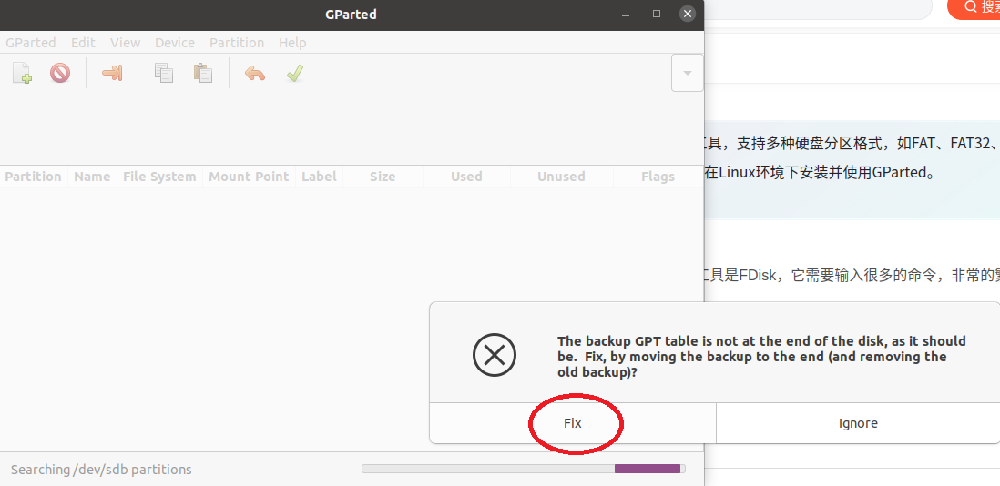
> 
>   3. Once inside the GParted interface, click on the upper right corner to switch to the target disk (choose the disk where the G1 system has been flashed), as shown below:  
>  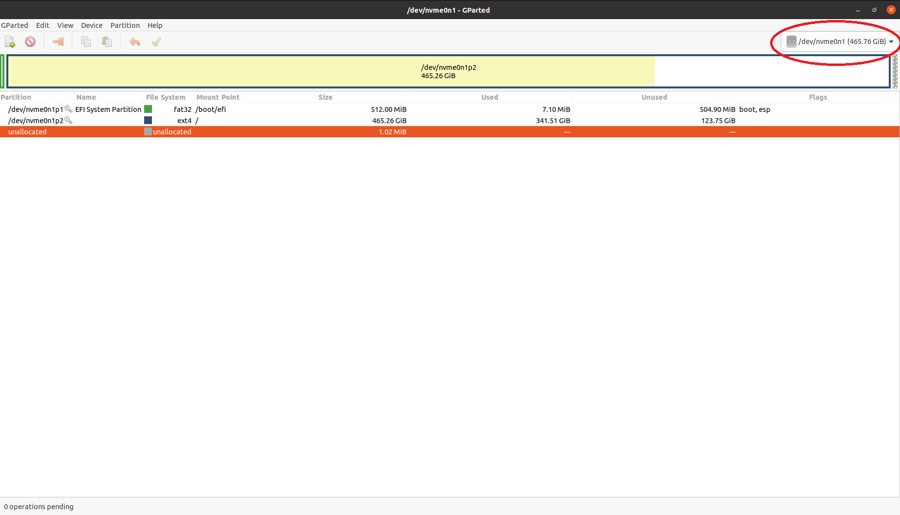
> 
>   4. After switching disks, you will see the unallocated space on the disk, as shown below:  
>  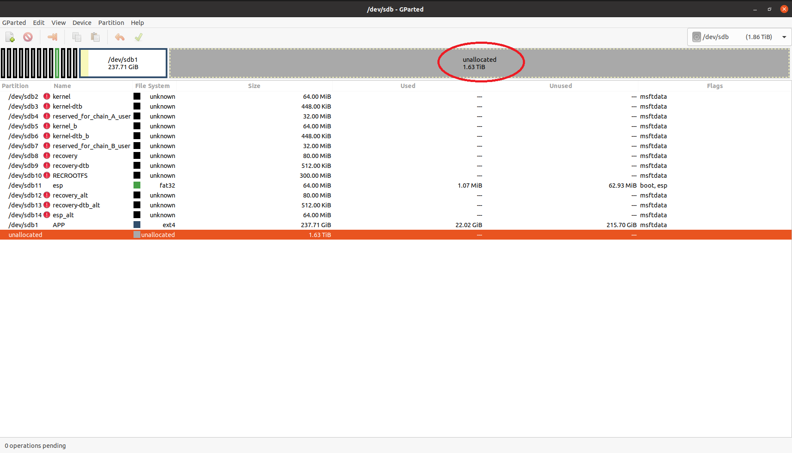
> 
>   5. Right-click on`/dev/sdb1`，and choose`Resize/Move`, as shown below:  
>  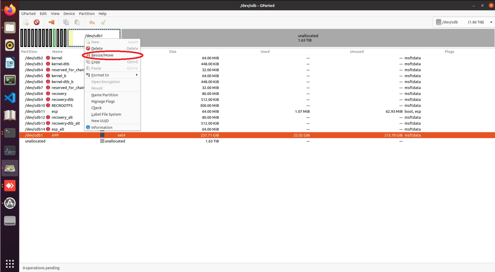
> 
>   6. Drag the red area shown in the figure below to the bottom using the left mouse button, as shown in the image:  
>  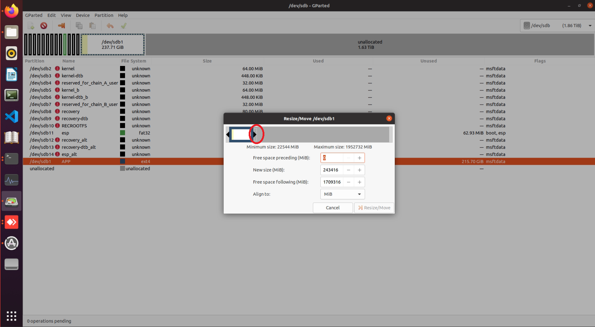
> 
>   7. After dragging, the interface will appear as shown below:  
>  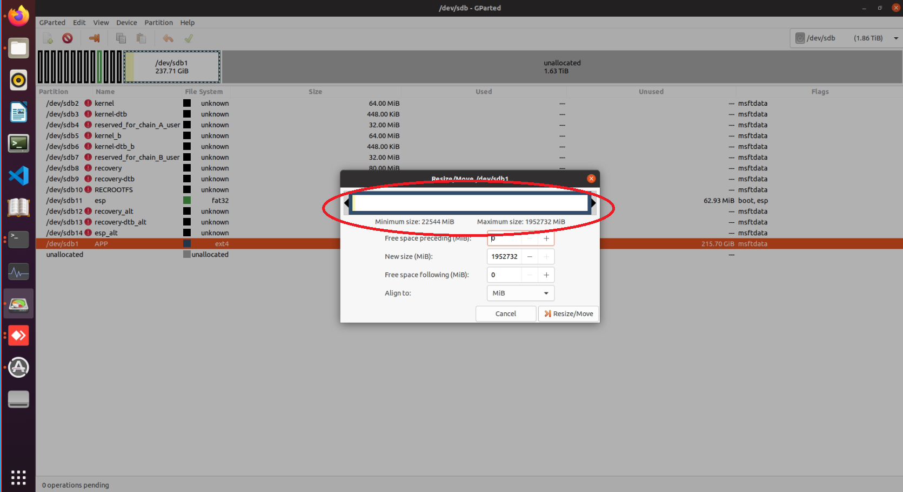
> 
>   8. Click the`Resize/Move`button, as shown below:  
>  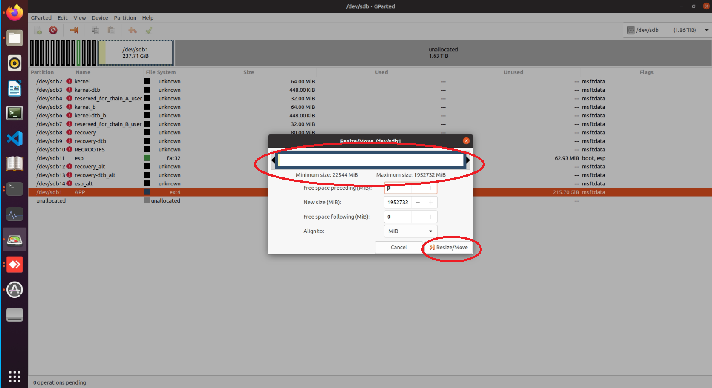
> 
>   9. After the new window appears, click the checkmark icon to apply changes, as shown below:  
>  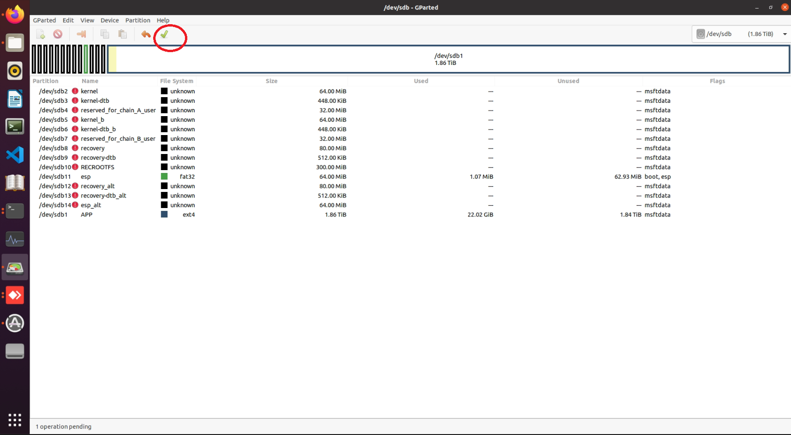
> 
>   10. In the next window, click the `Apply` button, as shown below:  
>  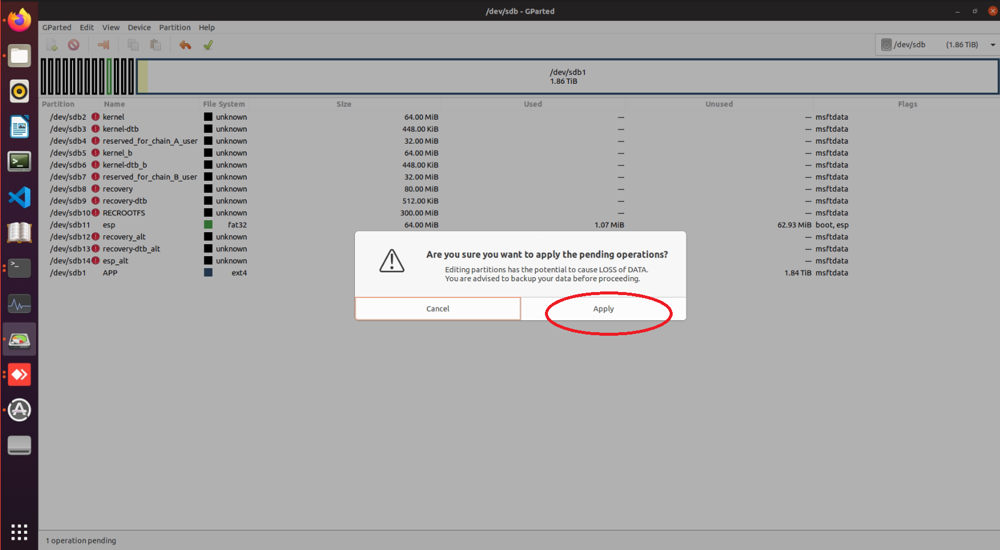
> 
>   11. Wait for the operation to complete, as shown below:  
>  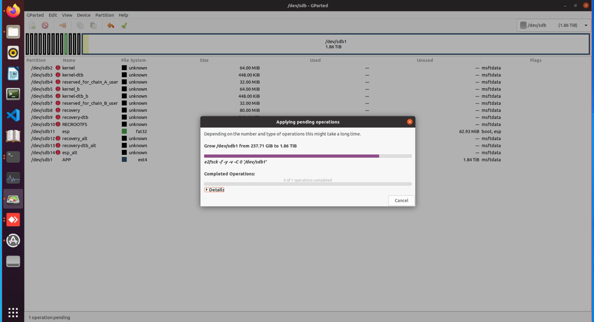
> 
>   12. Once completed, click the `Close` button, as shown below:  
>  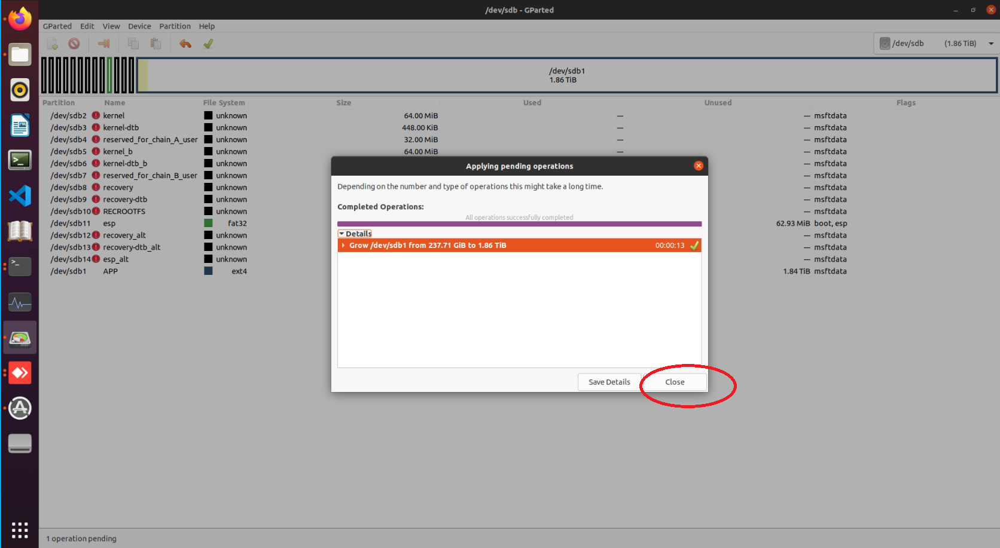
> 
> 

> 
> At this point, the disk expansion process for G1 is complete. You can now safely eject the disk from your PC and install it into the G1 device for normal usage.

### Method for Enabling WiFi After System Recovery on Jetson Orin NX

**Note:** The g1_nx_Jetpack5.1.1_20250930.img.bz2 image already includes built-in Wi-Fi support; after flashing, there is no need to use this method to enable Wi-Fi.

> Use the following commands to install the necessary software tools: 
>     
>     
>     sudo apt update
>     sudo apt install dkms debhelper build-essential devscripts libncurses-dev flex bison libssl-dev
> 
> Download the WiFi drive `.deb` package:  
>  [WIFI Driver Package](https://doc-cdn.unitree.com/static/2025/7/15/ddb95296714c46b28c4bfc56415c25aa.zip)  
>  After downloading and extracting the file, you will find a file named `rtl8852bu-dkms_1.19.14_arm64.deb `.  
>  Execute the following command to install the driver:
>     
>     
>     sudo dpkg -i ./rtl8852bu-dkms_1.19.14_arm64.deb
> 
> **Note: The installation of the WiFi driver may take a while, please wait patiently. It usually takes around 20~30 minutes. To monitor its progress, you can use the following command:**
>     
>     
>     sudo tail -f /var/lib/dkms/rtl8852bu/1.19.14/build/make.log
> 
> After the installation completes, restart the system using the following command:
>     
>     
>     sudo reboot
> 
> After rebooting, use the following command to verify whether the WiFi driver was successfully loaded:
>     
>     
>     ifconfig -a
> 
> If the output includes content similar to the following, the driver installation was successful:
>     
>     
>     unitree@ubuntu:~$ ifconfig -a
>     ...
>     ...
>     wlan0: flags=4098<BROADCAST,MULTICAST>  mtu 1500
>             ether fc:23:cd:8f:6f:f3  txqueuelen 1000  (Ethernet)
>             RX packets 0  bytes 0 (0.0 B)
>             RX errors 0  dropped 0  overruns 0  frame 0
>             TX packets 0  bytes 0 (0.0 B)
>             TX errors 0  dropped 0 overruns 0  carrier 0  collisions 0

### Regarding the issue of the Go interface being unable to preview video streams for depth cameras connected to the NX development board EDU+ device

> This is caused by missing essential patch files on the NX board. To resolve this, upgrade the NX board with the required patch files using the following steps: 
> 
> #### Download Patch Files
> 
> [NX System Patch](https://oss-global-cdn.unitree.com/static/ad3297c5c9bb40368c3e0c9febefa375.zip)
> 
>   1. **Copy the compressed file to the NX board** (IP: `192.168.123.164`, Username: `unitree`, Password: `123`):
> 

>     
>     
>     scp ./g1plus_pc4_unitree_install.zip unitree@192.168.123.164:~/
> 
>   2. **SSH into the NX board** (IP: `192.168.123.164`, Username: `unitree`, Password: `123`):
> 

>     
>     
>     ssh unitree@192.168.123.164
> 
>   3. **Switch to root privileges** (Password: `123`):
> 

>     
>     
>     sudo su root
> 
>   4. **Unzip the`g1plus_pc4_unitree_install.zip` file**:
> 

>     
>     
>     unzip g1plus_pc4_unitree_install.zip
> 
>   5. **Navigate to the`g1plus_pc4_unitree_install` directory and execute the installation script**:
> 

>     
>     
>     chmod -R 777 /home/unitree/g1plus_pc4_unitree_install
>     cd /home/unitree/g1plus_pc4_unitree_install/  
>     rm /unitree/ -rf  
>     ./install
> 
>   6. **Verify successful installation** by checking if the `master_service` process is running via the `ps` command:
> 

>     
>     
>     ps -ef | grep "master_service" | grep -v grep
> 
> After completing the above steps, contact technical support to:
> 
>   * Update the **Patch PC4** and **Video Hub PC4** components to the latest versions.
>   * Restart the device.
> 

## G1 Shoulder Board IO Usage Instructions

### G1-NX Shoulder Board IO Pin Description

!https://doc-cdn.unitree.com/static/2025/8/25/946f900a5d5644d192a4b7f917970bb4_2672x1892.jpeg

GPIO Number | Function  
---|---  
GPIO1 | UART_TXD  
GPIO2 | UART_RXD  
GPIO3 | I2C_SCL  
GPIO4 | I2C_SDA  
GPIO5 | GPIO  
GPIO6 | GPIO  
  
### UART Usage Instructions

Serial port parameters: Baud rate 9600, 8 data bits, no parity, 1 stop bit.  
After the G1 system starts, GPIO1 and GPIO2 are configured for UART functionality. They can be used simply with the following methods:
    
    
    # Serial output: test
    echo "test" > /dev/ttyTHS0
    
    # View data received by the serial port
    cat /dev/ttyTHS0

### I2C Usage Instructions

After the G1 system starts, GPIO3 and GPIO4 are configured for I2C functionality.  
When an I2C device is connected to the corresponding pins, the following command can be used to detect the device:
    
    
    root@ubuntu:/home/unitree# i2cdetect -y -r 0
         0  1  2  3  4  5  6  7  8  9  a  b  c  d  e  f
    00:          -- -- -- -- -- -- -- -- -- -- -- -- -- 
    10: -- -- -- -- -- -- -- -- -- -- -- -- -- -- -- -- 
    20: -- -- -- -- -- -- -- -- -- -- -- -- -- -- -- -- 
    30: -- -- -- -- -- -- -- -- -- -- -- -- -- -- -- -- 
    40: -- -- -- -- -- -- -- -- -- -- -- -- -- -- -- -- 
    50: 50 -- -- -- -- -- -- -- -- -- -- -- -- -- -- -- 
    60: -- -- -- -- -- -- -- -- -- -- -- -- -- -- -- -- 
    70: -- -- -- -- -- -- -- --

### GPIO Usage Instructions

After the G1-NX system starts, GPIO5 and GPIO6 are configured for GPIO functionality and can be used with the following methods:

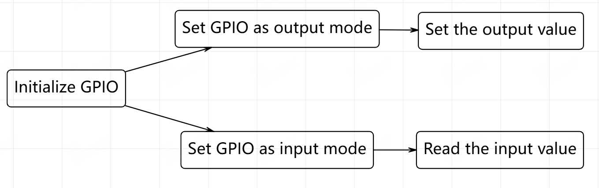

#### Controlling GPIO via Sysfs Interface

**Note:** When using, switch to root with the following command:
    
    
    su root

##### Initialize and Use GPIO

Expose the GPIO from kernel space to user space:
    
    
    # Export GPIO5 (number 330)
    echo 330 > /sys/class/gpio/export
    
    # Export GPIO6 (number 331)
    echo 331 > /sys/class/gpio/export

##### Set GPIO to Output Mode

Used to control external devices, such as LEDs, relays, etc.:
    
    
    # Set GPIO5 as output
    echo out > /sys/class/gpio/PCC.02/direction
    
    # Set GPIO6 as output
    echo out > /sys/class/gpio/PCC.03/direction

##### Set GPIO Level in Output Mode

Control GPIO to output high level (3.3V) or low level (0V):
    
    
    # GPIO5 outputs high level
    echo 1 > /sys/class/gpio/PCC.02/value
    
    # GPIO5 outputs low level
    echo 0 > /sys/class/gpio/PCC.02/value
    
    # GPIO6 outputs high level
    echo 1 > /sys/class/gpio/PCC.03/value
    
    # GPIO6 outputs low level
    echo 0 > /sys/class/gpio/PCC.03/value

##### Set GPIO to Input Mode

If GPIO needs to be used as an input, use the following method:
    
    
    # Set GPIO5 to input mode
    echo in > /sys/class/gpio/PCC.02/direction
    
    # Set GPIO6 to input mode
    echo in > /sys/class/gpio/PCC.03/direction

##### Read GPIO Value in Input Mode

When GPIO is set to input mode, the external input level can be read:
    
    
    # Read the input level of GPIO5 (0 for low level, 1 for high level)
    cat /sys/class/gpio/PCC.02/value
    
    # Read the input level of GPIO6
    cat /sys/class/gpio/PCC.03/value

##### Check Current GPIO Direction (Input / Output)

Check whether the GPIO is currently in input or output mode:
    
    
    # Check the direction of GPIO5
    cat /sys/class/gpio/PCC.02/direction
    
    # Check the direction of GPIO6
    cat /sys/极class/gpio/PCC.03/direction

##### Release GPIO

When GPIO is no longer in use, it needs to be unexported to release resources:
    
    
    # Unexport GPIO5 (corresponding number 330)
    echo 330 > /sys/class/gpio/unexport
    
    # Unexport GPIO6 (corresponding number 331)
    echo 331 > /sys/class/gpio/unexport

#### Controlling GPIO via Libgpiod

First, connect to the network and install gpiod. This method does not require logging in as root.

##### Preparation
    
    
    sudo apt install gpiod

#### Mapping Relationship

The mapping relationship for G1's GPIO in Libgpiod is:

GPIO | sysfs | Libgpiod  
---|---|---  
GPIO5 | PCC.02 | gpiochip 1 14  
GPIO6 | PCC.03 | gpiochip 1 15  
  
> The G1 has two GPIO chips in total. GPIO5 and GPIO6 are on chip 1, while the others are on chip 0. Use `gpiodetect` to view the current number of chips and their names, and use `gpioinfo [chip number]` to view the IO port mapping names and status for the corresponding chip.

##### Output Level

Libgpiod automatically handles the enable state. Use the command `gpioset gpiochip[chip number] [pin mapping number]=[level]` to set the GPIO pin to output mode and specify the level.
    
    
    gpioset gpiochip1 14=0
    gpioset gpiochip1 14=1

##### Read Level

Libgpiod automatically handles the enable state. Use the command `gpioget gpiochip[chip number] [pin mapping number]` to set the GPIO pin to input mode and read the level.
    
    
    gpioget gpiochip1 14

Effect:

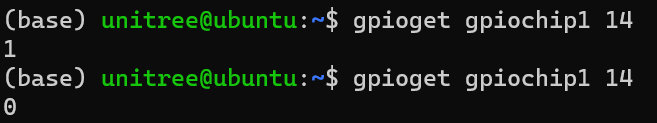
