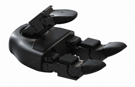
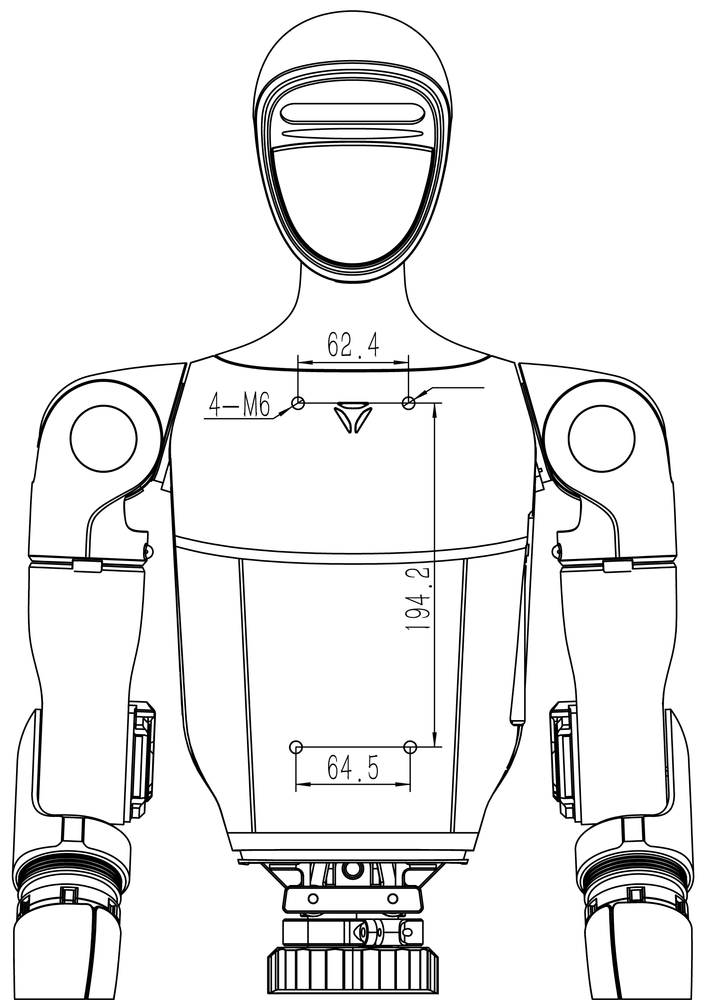
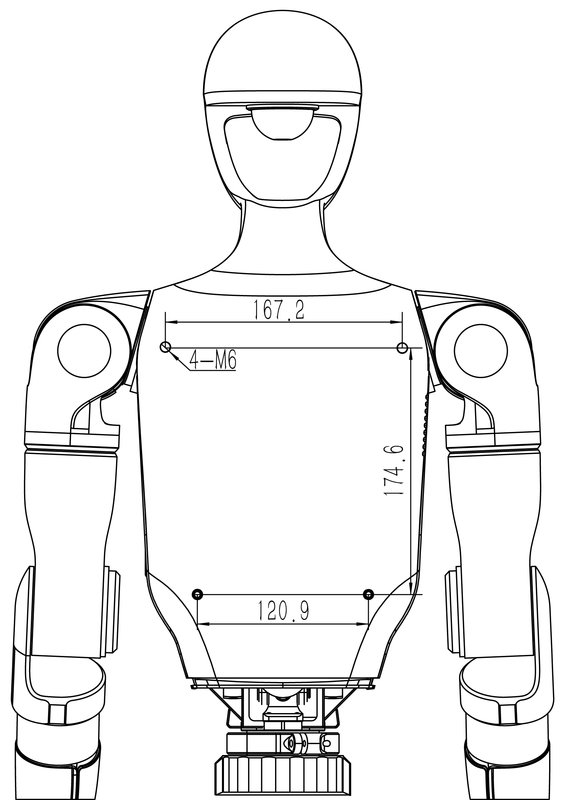
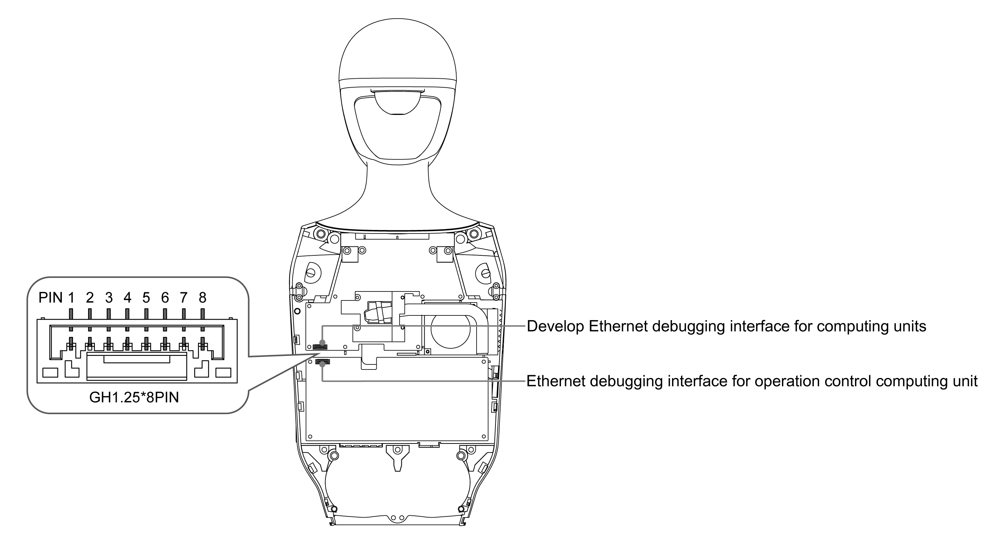
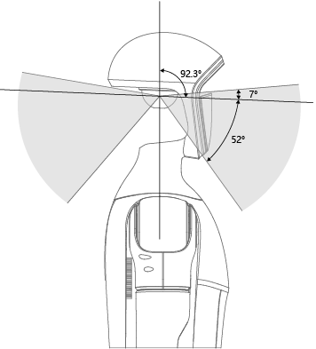
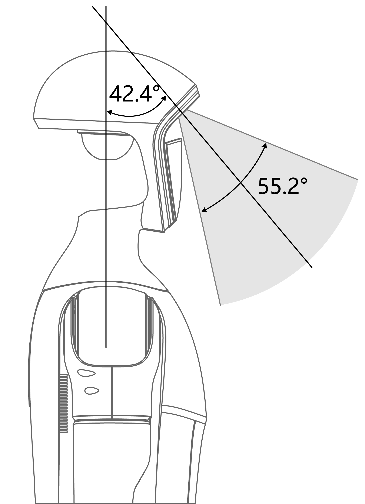

# About G1

**Source:** https://support.unitree.com/home/en/G1_developer/about_G1  
**Scraped:** 10092.017702057

---

Unitree humanoid robot development and use of warm tips:

Since the general public prefer to move more closely and naturally, the following attention to the use of humanoid robots, especially when shooting robot video:

  1. Developed leg movement procedures to bring the knee to upright or upright as far as possible;
  2. Reduce the stride frequency as much as possible, and avoid standing still as far as possible;
  3. Keep your feet slightly closer, and avoid leaving your feet away as much as possible when walking;

we hope the above content will help you.

Important Note on Video Crediting Suggestions

**Dear Developer,  
We recommend that when publishing your research outcomes in video format, you add the name or logo (Logo) of your laboratory in a prominent position throughout the video. This will prevent confusion about the actual source of the video as it circulates among the general public. Thank you for your support of Unitree Technology.**

# Part name

G1 whole machine is divided into upper body and lower body, with multiple degrees of freedom. A single arm has five degrees of freedom, including the shoulder, upper arm, and elbow joints. One leg has six degrees of freedom, including the hip, leg, hip, knee, and ankle joints. The waist has 1 degree of freedom, namely the lumbar joint. According to different versions, the whole machine can be divided into G1 basic version (23 degrees of freedom), G1-EDU version (23~43 degrees of freedom), by multiple joint motor degrees of freedom, so that the robot can achieve accurate motion and attitude control.

type | G1 | G1-EDU  
---|---|---  
Total Degrees of Freedom   
(Joint Freedom） | 23 | 23~43  
Single Leg Degrees of Freedom | 6 | 6  
Waist Degrees of Freedom | 1 | 1+ (Optional 2 additional waist degrees of freedom)  
Single Arm Degrees of Freedom | 5 | 5  
Single Hand Degrees of Freedom | / | **7**(Optional Force outrolled three-fingered dexterous hand Dex3-1) +**2**(Optional 2 additional wrist degrees of freedom)  
Component Description |  |   
  
## Dex3-1

Three-fingered dexterous hand Dex3-1 Electrical Parameter  |   
---|---  
Rendering image |   
|   
Operating voltage | 12-58V  
Range of Perception | 10g-2500g  
Degrees of freedom | Total degrees of freedom: 7  
1.The thumb has 3 active degrees of freedom;   
2.the index finger has 2 active degrees of freedom;   
3.the middle finger has 2 active degrees of freedom.  
Angle of Joint | Thumb: 0°~+100°, -35°~+60°, -60°~+60°;  
Index Finger and Middle Finger: 0°~+90°, 0°~+100°.  
Number of Array Sensors | 9  
  
Dexterous Hand Usage Tips 

When using the dexterous hand, always ensure that the robot's movements do not cause interference between the hand and the main body. You can add some outward offset to the shoulder motors to avoid collisions between the dexterous hand and the body. During development, it is not recommended to perform overly intense actions, such as running or balance tests, while the dexterous hand is attached.

## Installation hole position: unit: mm

If you need to use the G1 mounting hole, please remove the label on the hole first.

Positive Back

## Electrical Interface

The right side of the G1 is equipped with electrical interfaces, which are used to connect the various body joint motors, sensor peripherals, network ports, etc. This design makes it easy to debug, troubleshoot problems, and do secondary development.

Top view of equipment No. | Connector Name | Interface Description for short | Interface specification  
---|---|---|---  
1 | XT30UPB-F | VBAT | 58V/5A Battery power output   
(directly connected to battery power here)  
2 | XT30UPB-F | 24V | 24V/5A power output  
3 | XT30UPB-F | 12V | 12V/5A power output  
4 | RJ45 | 1000 BASE-T | GbE(gigabit Ethernet)  
5 | RJ45 | 1000 BASE-T | GbE(gigabit Ethernet)  
6 | Type-C | Type-C | Support USB3.0 host, 5V/1.5A power output  
7 | Type-C | Type-C | Support USB3.0 host, 5V/1.5A power output  
8 | Type-C | Type-C | Support USB3.0 host, 5V/1.5A power output  
9 | Type-C | Alt Mode Type-C | Supports USB3.2 host and DP1.4  
10 | 5577 | I/O OUT | 12V: 12V/3A power output   
See the following table for GPIO details  
RJ45 and the IO list interface GPIO Number | NX Pin Number | Multiplexing Relationship | Pin name of the debugfs file system  
---|---|---|---  
GPIO1 | 203 | UART1_TXD | GPIO3_PR.02  
GPIO2 | 205 | UART1_RXD | GPIO3_PR.03  
GPIO3 | 232 | I2C2_SCL | GPIO3_PI.03  
GPIO4 | 234 | I2C2_SDA | GPIO3_PI.04  
GPIO5 | 128 | GPIO | GPIO3_PCC.02  
GPIO6 | 130 | GPIO | GPIO3_PCC.03  
  
note：

There are many ways to operate NVIDIA GPIO, and the definition of NVIDIA GPIO can refer to the following link:  
<https://docs.nvidia.com/jetson/archives/r35.2.1/DeveloperGuide/text/HR/JetsonModuleAdaptationAndBringUp/JetsonOrinNxSeries.html#identifying-the-gpio-number>

## Debugging interface

G1 Back View

The Ethernet debugging interface of the operation control computing unit and the Ethernet debugging interface of the development computing unit are the same, and the line sequence is as follows:

PIN | Pin Description | RJ45 Line Sequence  
---|---|---  
1 | 0P | Orange and White  
2 | 0N | Orange  
3 | 1P | Green and White  
4 | 1N | Green  
5 | 2P | Blue and White  
6 | 2N | Blue  
7 | 3P | Brown White  
8 | 3N | Brown  
  
## On-board computer

G1-EDU onboard standard with 1 **operation and control computing unit** , and one **development computing unit**.

parameter | development computing unit (PC 2)  
---|---  
Model | Jetson Orin NX  
CPU | Arm® Cortex®-A78AE  
Number of cores | 8  
Number of threads | 8  
Max largest rate | 2 GHz  
graphic memory Memory | 16G  
Memory | 16G  
Cache | 2MB L2 + 4MB L3  
Storage | 2T  
Intel ® Image Processing Unit | No  
GPU | 1024 NVIDIA Ampere architecture Gpus with 32 Tensor cores  
Maximum dynamic frequency of graphics card | 918MHz  
Gaussian and Neuro Accelerator | 3.0  
Intel ® deep learning promotion | Yes  
Intel ®Adaptix™ Technology | Yes  
Intel ® hyperthreading technology | Yes  
Instructions set | 64bit  
OpenGL | 4.6  
OpenCL | 3.0  
DirectX | 12.1  
IP address | 192.168.123.164  
  
>   * **Transportation and control computing unit** is dedicated to Unitree motion control program and not open to the public. Developers can only use the **development computing unit** for secondary development. Initial user name:`unitree` password: `123`
>   * In the table, PC2 [**Development Computing Unit**] has an IP address of 192.168.123.164.
>   * CPU modules may ship to a more advanced version with no less than the above performance.
> 

## Field of view of G1 radar and camera

The G1 head is equipped with LIVOX-MID360 laser radar, which provides excellent environmental perception capabilities for robots.Lidar adopts omnidirectional and full-angle scanning technology, with a FOV level of up to 360° and a maximum vertical angle of 59°, enabling real-time acquisition of accurate environmental data.It can quickly identify and measure surrounding objects, providing high-resolution point cloud data.

MID360 laser radar FOV D435i Depth Camera FOV

The G1 head is equipped with a D435i depth camera, which provides the robot with excellent visual perception capabilities, enabling it to more accurately perceive and understand its surroundings, achieve precise spatial perception and obstacle detection, and enable the robot to interact with the environment and respond to various scenarios more intelligently and flexibly.

MID360+D435i Merged FOV

## Joint motor

The G1 joint adopts Unitree self-developed motor, which has excellent performance and characteristics. The maximum torque of the motor is 120N.m, and the design of the hollow axis makes the motor more lightweight and compact in structure. The motor is also equipped with dual encoders to provide more accurate position and velocity feedback to meet the needs of high precision control.

## Joint serial number and joint limit

Joint Index | Joint Name | limit(rad)  
---|---|---  
0 | L_LEG_HIP_PITCH | -2.5307~2.8798  
1 | L_LEG_HIP_ROLL | -0.5236~2.9671  
2 | L_LEG_HIP_YAW | -2.7576~2.7576  
3 | L_LEG_KNEE | -0.087267~2.8798  
4 | **L_LEG_ANKLE_PITCH** | -0.87267~0.5236  
5 | **L_LEG_ANKLE_ROLL** | -0.2618~0.2618  
6 | R_LEG_HIP_PITCH | -2.5307~2.8798  
7 | R_LEG_HIP_ROLL | -2.9671~0.5236  
8 | R_LEG_HIP_YAW | -2.7576~2.7576  
9 | R_LEG_KNEE | -0.087267~2.8798  
10 | **R_LEG_ANKLE_PITCH** | -0.87267~0.5236  
11 | **R_LEG_ANKLE_ROLL** | -0.2618~0.2618  
12 | WAIST_YAW | -2.618~2.618  
13 | **WAIST_ROLL** | -0.52~0.52  
14 | **WAIST_PITCH** | -0.52~0.52  
15 | L_SHOULDER_PITCH | -3.0892~2.6704  
16 | L_SHOULDER_ROLL | -1.5882~2.2515  
17 | L_SHOULDER_YAW | -2.618~2.618  
18 | L_ELBOW | -1.0472~2.0944  
19 | L_WRIST_ROLL | -1.972222054~1.972222054  
20 | L_WRIST_PITCH | -1.614429558~1.614429558  
21 | L_WRIST_YAW | -1.614429558~1.614429558  
22 | R_SHOULDER_PITCH | -3.0892~2.6704  
23 | R_SHOULDER_ROLL | -2.2515~1.5882  
24 | R_SHOULDER_YAW | -2.618~2.618  
25 | R_ELBOW | -1.0472~2.0944  
26 | R_WRIST_ROLL | -1.972222054~1.972222054  
27 | R_WRIST_PITCH | -1.614429558~1.614429558  
28 | R_WRIST_YAW | -1.614429558~1.614429558  
  
## Coordinate system, joint rotation axis and joint zero point

When all joints are zero, each coordinate system is as follows. Red is the X-axis, green is the Y-axis, and blue is the z-axis.

23 dof | 29dof  
---|---  
 |   
  
# Robot specifications

model  | G1 | G1-EDU  
---|---|---  
Height, Width and Thickness (Stand) | 1320x450x200mm | 1320x450x200mm  
Height, Width and Thickness (Fold) | 690x450x300mm | 690x450x300mm  
Weight (With Battery) | About 35kg | About 35kg  
Total Degrees of Freedom (Joint Freedom） | 23 | 23~43  
Single Leg Degrees of Freedom | 6 | 6  
Waist Degrees of Freedom | 1 | 1+ (Optional 2 additional waist degrees of freedom)  
Single Arm Degrees of Freedom | 5 | 5  
Single Hand Degrees of Freedom | / | **7** （Optional Force control of three-fingered hand）+**2**(Optional 2 additional wrist degrees of freedom)  
Joint output bearing | Industrial grade crossed roller bearings (high precision, high load capacity) | Industrial grade crossed roller bearings (high precision, high load capacity)  
Joint motor | Low inertia high-speed internal rotor PMSM(permanent magnet synchronous motor,better response speed and heat dissipation) | Low inertia high-speed internal rotor PMSM(permanent magnet synchronous motor,better response speed and heat dissipation)  
Maximum Torque of Knee Joint[1] | 90N.m | 120N.m  
Arm Maximum Load[2] | About 2Kg | About 3Kg  
Calf + Thigh Length | 0.6M | 0.6M  
Arm Span | About 0.45M | About.45M  
Extra Large Joint Movement Space | Waist joint：Z±155°  
Knee joint：0~165°  
Hip joint：P±154°、R-30~+170°、Y±158° | Waist joint：Z±155°、X±45°、Y±30°  
Knee joint：0~165°  
Hip joint：P±154°、R-30~+170°、Y±158°  
Wrist joint：P±92.5°、Y±92.5°  
Full Joint Hollow Electrical Routing | YES | YES  
Joint Encode | Dual encoder | Dual encoder  
Cooling System | Local air cooling | Local air cooling  
Power Supply | 13 string lithium battery | 13 string lithium battery  
Basic Computing Power | 8-core high-performance CPU | 8-core high-performance CPU  
Sensing Sensor | Depth Camera+3D LiDAR | Depth Camera+3D LiDAR  
4 Microphone Array | YES | YES  
5W Speaker | YES | YES  
WiFi 6 、Bluetooth 5.2 | YES | YES  
High Computing Power Module | / | NVIDIA Jetson Orin  
Smart Battery (Quick Release) | 9000mAh | 9000mAh  
Charger | 54V 5A | 54V 5A  
Manual Controller | YES | YES  
Battery Life | About 2h | About 2h  
Upgraded Intelligent OTA | YES | YES  
Secondary Development[3] | / | YES  
  
Note

[1] The maximum torque of the joint motors of the whole machine is different. This is the maximum torque of the largest joint motor among them.  
[2] The maximum load of the arm varies greatly under different arm extension postures.  
[3] For more information, please read the secondary development manual.  
[4] For more detailed warranty terms, please read the product warranty brochure.  
[5] The above parameters may vary in different scenarios and configurations, please subject to actual situation.  
[6] The humanoid robot has a complex structure and extremely powerful power. Users are asked to keep a sufficient safe distance between the humanoid robot and the humanoid robot.Please use with caution  
[7] If any change in the appearance of the product, please refer to the actual product.  
[8] This product is a civilian robot. We kindly request that all users refrain from making any dangerous modifications or using the robot in a hazardous manner.  
[9] Please visit Unitree Robotics Website for more related terms and policies, and comply with local laws and regulations.
