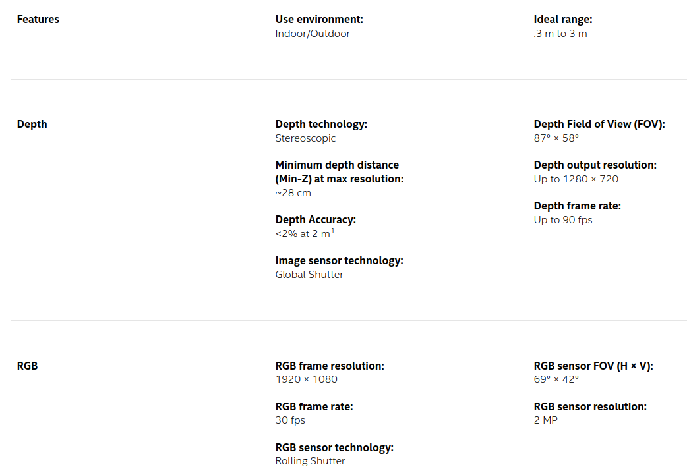
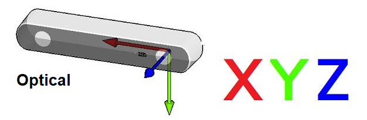
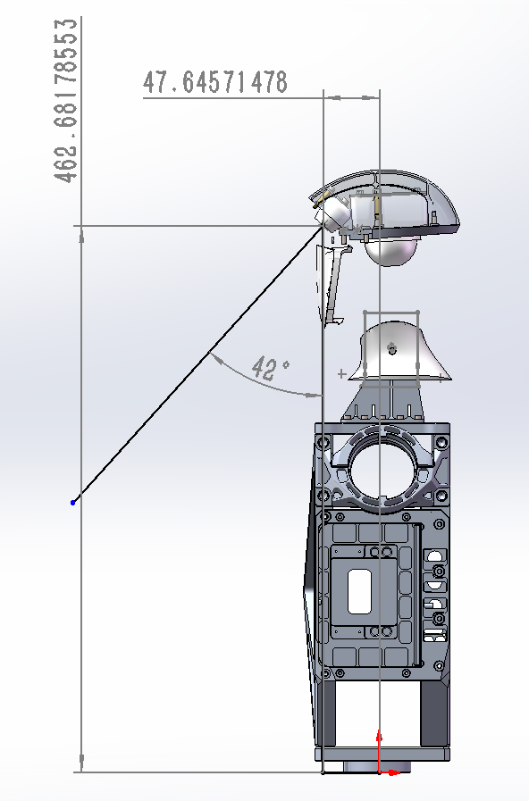
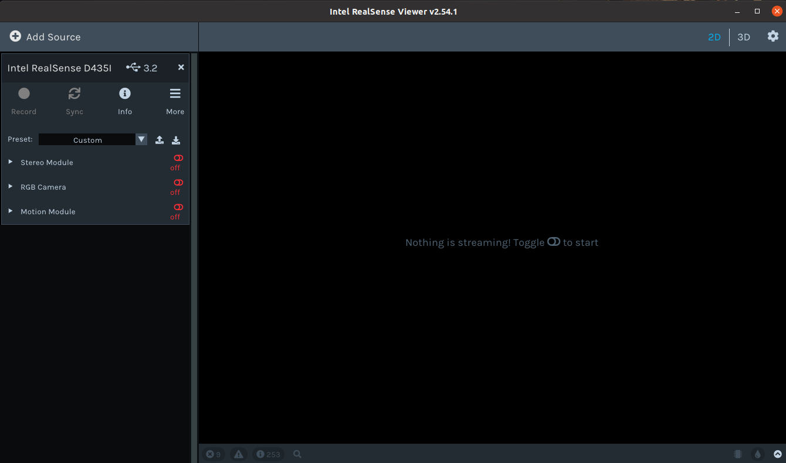
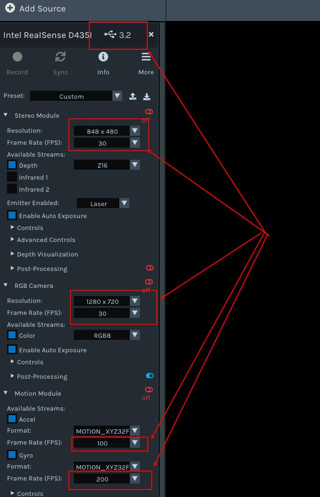
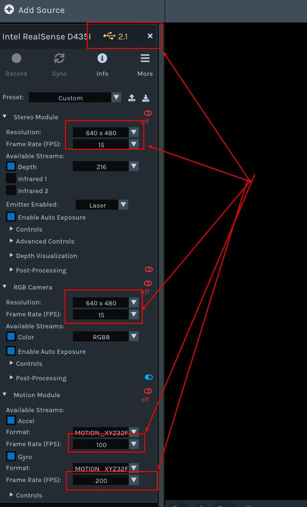

# Depth Camera Instruction

**Source:** https://support.unitree.com/home/en/G1_developer/depth_camera_instruction  
**Scraped:** 10295.955583523

---

# 1、G1 robot depth camera introduction and official information acquisition

The G1 robot depth camera is located overhead and is a realsense D435i.  
The camera includes binocular infrared camera (global shutter), laser transmitter, RGB camera (rolling shutter), and 6-axis imu.  

  * Product page: <https://www.intelrealsense.com/depth-camera-d435/realsense>
  * Detailed documentation: **<https://dev.intelrealsense.com/docs/docs-get-started>**
  * Github official address: **<https://github.com/IntelRealSense>**

The depth camera coordinate system, the relationship between the depth camera coordinate system and the robot center coordinate system:  
  

# 2\. Data acquisition

## 2.1 View the data through the host computer

On windows,the download **Intel RealSense. Viewer.Exe**  
links: **https://github.com/IntelRealSense/librealsense/releases**  
On Linux, need to compile the SDK installation.

  * Ubuntu 18/20/22 LTS installation reference: **<https://github.com/IntelRealSense/librealsense/blob/master/doc/installation.md>**
  * NVIDIA Jetson system installation reference: **<https://github.com/IntelRealSense/librealsense/blob/master/doc/installation_jetson.md>**
  * Raspberry Pi system installation reference: **<https://github.com/IntelRealSense/librealsense/blob/master/doc/RaspberryPi3.md>**

Before use, you need to install `librealsense` on the robot's NX computer platform.  
When the hardware connection is normal, enter realsense-viewer on the terminal to open the software. You can view:  

## 2.2 Get data via ros

Ros camera driver code warehouse: **<https://github.com/IntelRealSense/realsense-ros>**  
Refer to the readme file of the code repository for detailed instructions.  
In daily use, it is recommended to obtain data through the sdk and process it.

## 2.3 Obtain data through the SDK

Camera SDK code warehouse: **<https://github.com/IntelRealSense/librealsense>**

The use of SDK can be referred to: Code content in `/librealsense-2.54.1/examples`

**Reference demo:**
    
    
    /**
     * @file test.cpp
     * get_camera_imu_stream_test
     *
     */
    #include <librealsense2/rs.hpp>
    #include <librealsense2/hpp/rs_internal.hpp>
    #include <unistd.h>
    #include <iostream>
    
    #include <mutex>
    #include <thread>
    
    #include <opencv2/core.hpp>
    #include <opencv2/imgproc.hpp>
    #include <opencv2/imgcodecs.hpp>
    #include <opencv2/highgui.hpp>
    
    
    
    std::mutex mutex;
    rs2::frameset fs_frame = {};
    double fs_timestamp = 0.0;
    bool fs_flag = false;
    
    
    
    void stream_callback(const rs2::frame& frame){ 
        static double fs_last_timestamp = 0.0;
        static double gyro_last_timestamp = 0.0;
        static double accel_last_timestamp = 0.0;
    
        if(rs2::frameset c_frame = frame.as<rs2::frameset>()){
            // do not use
            // // double f_timestamp = c_frame.get_timestamp()*1e-3;
            // // printf("frame f_timestamp:   %.4f \n", f_timestamp);
    
            double clc_timestamp;{
                struct timespec time = {0};
                clock_gettime(CLOCK_REALTIME, &time);
                clc_timestamp = time.tv_sec + time.tv_nsec*1e-9;
            }
    
            std::unique_lock<std::mutex> lock(mutex);
            fs_frame = c_frame;
            fs_timestamp = clc_timestamp;
            fs_flag = true;
            lock.unlock();
    
    
            // printf("frame clc_timestamp:  %.4f \n", clc_timestamp);
            // printf("frame fps:  %.4f \n", 1/(clc_timestamp - fs_last_timestamp));
    
            fs_last_timestamp = clc_timestamp;
        }else if(rs2::motion_frame m_frame = frame.as<rs2::motion_frame>()){
    
            if (m_frame.get_profile().stream_name() == "Gyro"){
                double clc_timestamp;{
                    struct timespec time = {0};
                    clock_gettime(CLOCK_REALTIME, &time);
                    clc_timestamp = time.tv_sec + time.tv_nsec*1e-9;
                }
    
                // Get gyro measures
                rs2_vector gyro_data = m_frame.get_motion_data();
                
                // std::cout << "gyro_data" << gyro_data << std::endl;
    
                // printf("gyro clc_timestamp:  %.4f \n", clc_timestamp);
                // printf("gyro fps:  %.4f \n", 1/(clc_timestamp - gyro_last_timestamp));
    
                gyro_last_timestamp = clc_timestamp;
            }else if (m_frame.get_profile().stream_name() == "Accel"){
                double clc_timestamp;{
                    struct timespec time = {0};
                    clock_gettime(CLOCK_REALTIME, &time);
                    clc_timestamp = time.tv_sec + time.tv_nsec*1e-9;
                }
                
                // Get accelerometer measures
                rs2_vector accel_data = m_frame.as<rs2::motion_frame>().get_motion_data();
                // std::cout << "accel_data" << accel_data << std::endl;
    
                // printf("accel clc_timestamp:  %.4f \n", clc_timestamp);
                // printf("accel fps:  %.4f \n", 1/(clc_timestamp - accel_last_timestamp));
    
                accel_last_timestamp = clc_timestamp;
            }
        }
    }
    
    
    
    rs2::device get_a_realsense_device()
    {
        // Instantiate context
        rs2::context ctx;
    
        // The query_device method of the context retrieves a list of devices and returns a Device_List object
        rs2::device_list devices = ctx.query_devices();
    
        // Instantiate device
        rs2::device selected_device;
        if (devices.size() == 0){
            std::cerr << "No device connected!!!!!" << std::endl;
            exit(0);
        }
        
        // Printing device information
        std::cout <<"get device num: "<<devices.size()<<std::endl;
        for (int i = 0; i < devices.size(); i++){
            std::vector<rs2::sensor> sensors = devices[i].query_sensors();
            std::string serial = devices[i].get_info(RS2_CAMERA_INFO_SERIAL_NUMBER);
            std::string port = devices[i].get_info(RS2_CAMERA_INFO_PHYSICAL_PORT);
    
            std::cout << "get serial " << i << " : " << serial << std::endl;
            std::cout << "get port " << i << " : " << port << std::endl;
        }
    
        // Passing the first device to the selected_device obtained by device instantiation
        selected_device = devices[0];
    
        // At this point, selected_device represents our current device and returns it
        return selected_device;
    }
    
    
    
    void  get_sensor_option(const rs2::sensor& sensor)
    {
        std::cout << "Sensor name: " << "<"  << sensor.get_info(RS2_CAMERA_INFO_NAME) << ">" <<std::endl;
        std::cout << "This sensor supports the following options:\n" << std::endl;
        // Cycle all parameters
        for (int i = 0; i < static_cast<int>(RS2_OPTION_COUNT); i++)
        {
            rs2_option option_type = static_cast<rs2_option>(i);
            
            // Firstly, determine whether the sensor supports this option setting
            if (sensor.supports(option_type))
            {
                // Retrieve and print a description of the current option
                const char* description = sensor.get_option_description(option_type);
    
                // Retrieve the value of the current option
                float current_value = sensor.get_option(option_type);
    
                // Get the value range, default value, and value step size of the option
                rs2::option_range range = sensor.get_option_range(option_type);
                float default_value = range.def;
                float maximum_supported_value = range.max;
                float minimum_supported_value = range.min;
                float difference_to_next_value = range.step;
    
                // print
                std::cout << "    " << i << ": "  << "<" << option_type  << ">" << std::endl;
                std::cout << "        Description   : " << description << std::endl;
                std::cout << "        Min Value     : " << minimum_supported_value << std::endl;
                std::cout << "        Max Value     : " << maximum_supported_value << std::endl;
                std::cout << "        Step          : " << difference_to_next_value << std::endl;
                std::cout << "        Default Value : " << default_value << std::endl;
                std::cout << "        Current Value : " << current_value << std::endl;
                std::cout << std::endl;
            }
            else
            {
                //std::cout << "        is not supported by this sensor" << std::endl;
            }
        }
        std::cout << std::endl;
        std::cout << std::endl;
    }
    
    
    
    void change_sensor_option(const rs2::sensor& sensor, rs2_option option_type, float requested_value)
    {
        // Firstly, determine whether the sensor supports this option setting
        if (!sensor.supports(option_type))
        {
            std::cout << "option is not supported by sensor " << "<"  << sensor.get_info(RS2_CAMERA_INFO_NAME) << ">" << std::endl;
            return;
        }
        else
        {
            // Use the set_option function to assign new values to options
            sensor.set_option(option_type, requested_value);
            std::cout << "<"  << sensor.get_info(RS2_CAMERA_INFO_NAME) << "> " << "change " << "<" << option_type  << ">" << " to " << ": " << requested_value << std::endl;
        }
    
    }
    
    
    
    void l_get_intrinsics(const rs2::stream_profile& stream, float &_fx, float &_fy, float &_cx, float &_cy)
    {
    
        // A sensor's stream (rs2::stream_profile) is in general a stream of data with no specific type.
        // For video streams (streams of images), the sensor that produces the data has a lens and thus has properties such
        //  as a focal point, distortion, and principal point.
        // To get these intrinsics parameters, we need to take a stream and first check if it is a video stream
        if (rs2::video_stream_profile video_stream = stream.as<rs2::video_stream_profile>())
        {
            try
            {
                // Using the get_intriniscs method to obtain camera intrinsic parameters
                rs2_intrinsics intrinsics = video_stream.get_intrinsics();
                // Process some results
                auto principal_point = std::make_pair(intrinsics.ppx, intrinsics.ppy);
                auto focal_length = std::make_pair(intrinsics.fx, intrinsics.fy);
                rs2_distortion model = intrinsics.model;
    
                
                /*std::cout << "width*height         : " << intrinsics.width << " * " << intrinsics.height << std::endl;
                std::cout << "Principal Point         : " << principal_point.first << ", " << principal_point.second << std::endl;
                std::cout << "Focal Length            : " << focal_length.first << ", " << focal_length.second << std::endl;
                std::cout << "Distortion Model        : " << model << std::endl;
                std::cout << "Distortion Coefficients : [" << intrinsics.coeffs[0] << "," << intrinsics.coeffs[1] << "," <<
                intrinsics.coeffs[2] << "," << intrinsics.coeffs[3] << "," << intrinsics.coeffs[4] << "]" << std::endl;*/
                std::cout << "\n\n--------------- intrinsics ---------------" << std::endl;
                std::cout << "width*height         : " << intrinsics.width << " * " << intrinsics.height << std::endl;
                std::cout << "Camera.fx: " << focal_length.first << std::endl;
                std::cout << "Camera.fy: " << focal_length.second << std::endl;
                std::cout << "Camera.cx: " << principal_point.first << std::endl;
                std::cout << "Camera.cy: " << principal_point.second << std::endl;
                std::cout << "---------------  ---------------\n\n" << std::endl;
    
                _fx = focal_length.first;
                _fy = focal_length.second;
                _cx = principal_point.first;
                _cy = principal_point.second;
            }
            catch (const std::exception &e)
            {
                std::cout << "Failed to get intrinsics for the given stream. " << e.what() << std::endl;
            }
        }
    }
    
    
    
    int main()
    {    
        rs2::device selected_device;
        selected_device = get_a_realsense_device();
    
        std::vector<rs2::sensor> sensors = selected_device.query_sensors();
    
        // Print sensor parameters
        for (rs2::sensor sensor : sensors){
            get_sensor_option(sensor);
        }
    
        // Set sensor parameters
        for (rs2::sensor sensor : sensors){
            std::string sensor_name = sensor.get_info(RS2_CAMERA_INFO_NAME);
            if(sensor_name == "Stereo Module"){ // Depth camera
                change_sensor_option(sensor, RS2_OPTION_VISUAL_PRESET, rs2_rs400_visual_preset::RS2_RS400_VISUAL_PRESET_HIGH_ACCURACY);
                change_sensor_option(sensor, RS2_OPTION_ENABLE_AUTO_EXPOSURE, 1);
                change_sensor_option(sensor, RS2_OPTION_EMITTER_ENABLED, 1);
                change_sensor_option(sensor, RS2_OPTION_LASER_POWER, 150);
            }else if(sensor_name == "RGB Module"){
                change_sensor_option(sensor, RS2_OPTION_ENABLE_AUTO_EXPOSURE, 1);
            }else if(sensor_name == "Motion Module"){
                // ...
            }
        }
        
    
        // Instantiate pipeline and config
        rs2::pipeline pipe;
        rs2::config cfg;
    
        // Depth stream
        cfg.enable_stream(RS2_STREAM_DEPTH, 640, 480, RS2_FORMAT_Z16, 60);
        // IR_left stream
        cfg.enable_stream(RS2_STREAM_INFRARED, 1, 640, 480, RS2_FORMAT_Y8, 60);
        // IR_right stream
        cfg.enable_stream(RS2_STREAM_INFRARED, 2, 640, 480, RS2_FORMAT_Y8, 60);
        // RGB stream
        cfg.enable_stream(RS2_STREAM_COLOR, 848, 480, RS2_FORMAT_BGR8, 60);
        // IMU GYRO stream
        cfg.enable_stream(RS2_STREAM_GYRO , RS2_FORMAT_MOTION_XYZ32F, 400);
        // IMU ACCEL stream
        cfg.enable_stream(RS2_STREAM_ACCEL, RS2_FORMAT_MOTION_XYZ32F, 200);
    
        rs2::pipeline_profile pipe_profile = pipe.start(cfg, stream_callback);
    
        // get Depth(IR_left) intrinsics
        float mCamera_fx, mCamera_fy, mCamera_cx, mCamera_cy;
        l_get_intrinsics(pipe_profile.get_stream(RS2_STREAM_DEPTH), mCamera_fx, mCamera_fy, mCamera_cx, mCamera_cy);
    
        // post process
        rs2::temporal_filter temp_filter;  
        temp_filter.set_option(rs2_option::RS2_OPTION_HOLES_FILL, 6);
        temp_filter.set_option(rs2_option::RS2_OPTION_FILTER_SMOOTH_ALPHA, 0.4f);
        temp_filter.set_option(rs2_option::RS2_OPTION_FILTER_SMOOTH_DELTA, 20);
    
        double _timestamp_last = 0.0;
        while (true){
            rs2::frameset _frame = {};
            double _timestamp = 0.0;
            bool _flag = false;
            std::unique_lock<std::mutex> lock(mutex);
            _frame = fs_frame;
            _timestamp = fs_timestamp;
            _flag = fs_flag;
            fs_flag = false;
            lock.unlock();
    
            if(_flag){
                printf("_frame fps:  %.4f \n", 1/(_timestamp - _timestamp_last));
    
                // Obtain data for each image
                rs2::depth_frame depth_frame = _frame.get_depth_frame();
                rs2::video_frame color_frame = _frame.get_color_frame();
                rs2::frame irL_frame = _frame.get_infrared_frame(1);
                rs2::frame irR_frame = _frame.get_infrared_frame(2);
    
    
                rs2::depth_frame depth_frame_filtered = temp_filter.process(depth_frame);
    
                // Convert image data to OpenCV format
                cv::Mat depth_image(cv::Size(640, 480), CV_16U , (void*)depth_frame.get_data(), cv::Mat::AUTO_STEP); // Depth
                cv::Mat color_image(cv::Size(848, 480), CV_8UC3, (void*)color_frame.get_data(), cv::Mat::AUTO_STEP); // RGB
                cv::Mat irL_image  (cv::Size(640, 480), CV_8UC1, (void*)irL_frame.get_data()  , cv::Mat::AUTO_STEP); // IR_left
                cv::Mat irR_image  (cv::Size(640, 480), CV_8UC1, (void*)irR_frame.get_data()  , cv::Mat::AUTO_STEP); // IR_right
    
                cv::Mat p_depth_image(cv::Size(640, 480), CV_16U , (void*)depth_frame.get_data(), cv::Mat::AUTO_STEP); // post processed Depth
    
                // show pictures
                if (color_image.empty() || depth_image.empty() || irL_image.empty() || irR_image.empty()) {
                    std::cerr << "One or more images are empty." << std::endl;
                    continue;
                }
                cv::imshow("depth", depth_image);
                cv::imshow("color", color_image);
                cv::imshow("irL", irL_image);
                cv::imshow("irR", irR_image);
                cv::imshow("p_depth", depth_image);
                cv::waitKey(1);
    
                _timestamp_last = _timestamp;
            }else{
                usleep(2000);
            }
    
        }
        return 0;
    }
    
    
    cmake_minimum_required(VERSION 3.1.0)
    
    project(get_camera_imu_stream_test)
    
    
    set(CMAKE_BUILD_TYPE Release)
    set(CMAKE_CXX_FLAGS_RELEASE "-O3 -w")
    set(CMAKE_C_FLAGS_RELEASE "-O3 -w")
    
    # Find librealsense2 installed package
    find_package(realsense2 REQUIRED)
    find_package(OpenCV REQUIRED)
    
    # Enable C++11
    set(CMAKE_CXX_STANDARD 11)
    set(CMAKE_CXX_STANDARD_REQUIRED TRUE)
    
    # Add the application sources to the target
    add_executable(${PROJECT_NAME} test.cpp)
    
    # Link librealsense2 to the target
    target_link_libraries(${PROJECT_NAME} ${realsense2_LIBRARY} ${OpenCV_LIBS})

## 2.4 Regarding the USB 2.0 and USB 3.0 connection issues of realsense depth cameras

When the depth camera is connected to usb3.0, the 'realsense viewer' software can display its supported resolutions and frame rates:  
  
When connecting a depth camera to usb2.0, it is necessary to use a hub adapter to obtain data using the SDK normally. It can also be directly used on the NX processor of G1. Under USB 2.0 connection, the frame rate and resolution that can be obtained may differ from those under USB 3.0 connection. The 'realsense viewer' software can display the supported resolutions and frame rates:  

