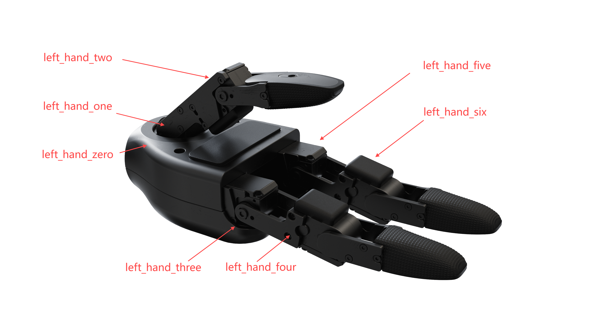
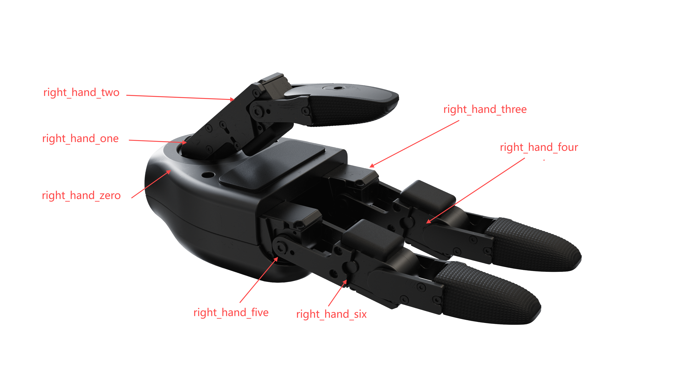
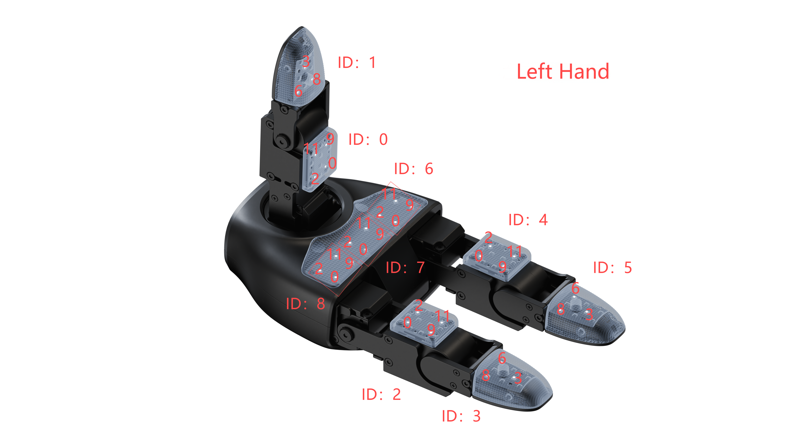
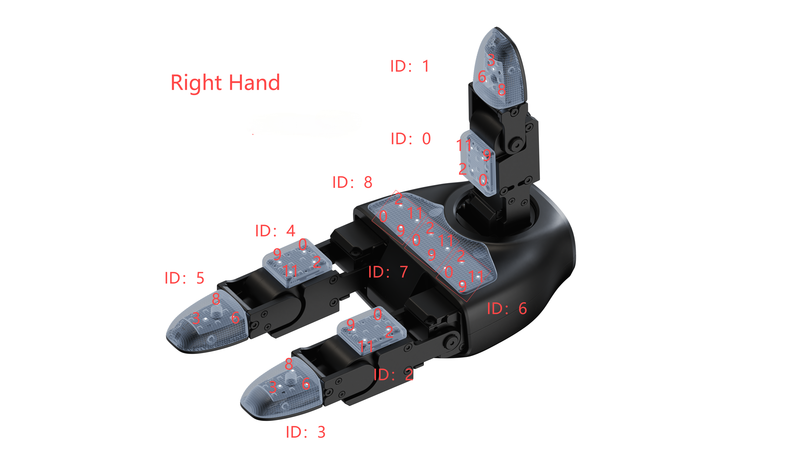

# Dexterous Hand

**Source:** https://support.unitree.com/home/en/G1_developer/dexterous_hand  
**Scraped:** 10180.032754928

---

## Introduction to Dexterous Hands

The G1 can be optionally equipped with Unitree's self-developed Dex3-1 force-controlled dexterous hand. This dexterous hand has 3 fingers, with 2 bending degrees of freedom for each, and an additional rotational degree of freedom for the thumb, totaling 7 degrees of freedom.

The dexterous hand can be optionally equipped with tactile sensor arrays, with a 3x4 array sensor at each fingertip position (6 locations in total).

This document only covers how to control the G1's dexterous hand through unitree_sdk2, with demo programs attached at the end showing examples of obtaining hand status information and control functions.

The dexterous hands are distinguished between left and right hands. Each Dex3-1 dexterous hand is left-right symmetric. When controlling the dexterous hands, communication is conducted through different message channels to control the corresponding hand. See the dexterous hand control methods section for details.


You can access unitree_sdk2 from here, and see Quick Development for operation instructions.  
The source code for this chapter's examples is located in [GitHub](https://github.com/unitreerobotics/unitree_sdk2/blob/main/example/g1/dex3/dex3_subscribe.cpp).

## Technical parameters

Model | Control interface | Degree of freedom | Rated voltage  
---|---|---|---  
Dex3-1 | RS485 | 7 | 24V  
  
## Dexterous hand control method

G1 internally provides a resident service program that communicates with Dex3-1 and converts to DDS messages. This service receives and processes user requests.

After obtaining unitree_sdk2, the system will load the message structure library. Users can control the corresponding dexterous hand by correctly using the message structures and communicating with the corresponding interfaces.

The dexterous hand header files are located at:  
`/usr/local/include/unitree/hg_idl/HandState_.hpp`  
`/usr/local/include/unitree/hg_idl/HandCmd_.hpp`  
Users can check the structure information in these files.

### Sort by message structure

According to the message structure ordering, the fingers are defined as thumb, index finger, and middle finger based on human perception, and arranged in sequence.

The unitree_hg::msg::dds_::HandCmd_.motor_cmd and unitree_hg::msg::dds_::HandState_.motor_state message structures contain information for all dexterous hand motors, with the following motor order:

Hand Joint Index in IDL | Hand Joint Name  
---|---  
0 | thumb_0  
1 | thumb_1  
2 | thumb_2  
3 | middle_0  
4 | middle_1  
5 | index_0  
6 | index_1  
  
### Sort by URDF

Since the URDF version of the dexterous hand generates position information in the same coordinate system, there are slight differences between left and right hands. The URDF can be obtained from the [open-source platform](https://github.com/unitreerobotics/unitree_ros/tree/master/robots/g1_description).

**Left hand** 

Hand Joint Index in URDF | Hand Joint Index in IDL | Hand Joint Name |   
---|---|---|---  
left_hand_zero | 0 | thumb_0 |   
left_hand_one | 1 | thumb_1 |   
left_hand_two | 2 | thumb_2 |   
left_hand_five | 3 | middle_0 |   
left_hand_six | 4 | middle_1 |   
left_hand_three | 5 | index_0 |   
left_hand_four | 6 | index_1 |   
  
**Right hand**

Hand Joint Index in URDF | Hand Joint Index in IDL | Hand Joint Name  
---|---|---  
right_hand_zero | 0 | thumb_0  
right_hand_one | 1 | thumb_1  
right_hand_two | 2 | thumb_2  
right_hand_three | 3 | middle_0  
right_hand_four | 4 | middle_1  
right_hand_five | 5 | index_0  
right_hand_six | 6 | index_1  
  
### Interface Description

Users can control the dexterous hand by sending unitree_hg::msg::dds_::HandCmd_ messages to the topic "rt/dex3/(left or right)/cmd".  
To receive the dexterous hand status, subscribe to the topic "rt/dex3/(left or right)/state" for unitree_hg::msg::dds_::HandState_ messages.

#### IDL Data Format:

Below are the control and status structures used in this communication:

Control structure HandCmd_:
    
    
    struct HandCmd_ {
        sequence<unitree_hg::msg::dds_::MotorCmd_> motor_cmd;
        unsigned long reserve[4];
    };//struct HandCmd_ 

MotorCmd_ structure:
    
    
    typedef struct {            // Motor control command data packet  20 bytes
        uint8_t    head[2];     // Header 0xFE 0xEE participates in CRC
        RIS_Mode_t mode;        // Motor control mode  1Byte
        uint8_t    res;         // Reserved
        int16_t    tor_des;     // Desired joint output torque  256 represents 1mNM
        int16_t    spd_des;     // Desired joint output speed  256/2π represents 100rad/s
        int32_t    pos_des;     // Desired joint output position  32768/2π represents 1rad
        int16_t    k_pos;       // Desired joint stiffness coefficient 1280 represents 1mN.m/rad
        int16_t    k_spd;       // Desired joint damping coefficient 1280 represents 1mN.m/100rad/s
        uint32_t   CRC32;       // CRC32
    } MotorCmd_t;
    
    
    RIS_Mode_t structure:
    ```cpp
    typedef struct {
        uint8_t id     : 4;     // Motor ID: 0,1...,13,14  15 represents broadcasting to all motors
        uint8_t status : 3;     // Working mode: 0.Lock 1.FOC 6
        uint8_t timeout: 1;     // Master->Motor: 0.Disable timeout protection 1.Enable (Default 1s timeout)
                               // Motor->Master: 0.No timeout 1.Timeout protection triggered (needs control bit 0 to clear)
    } RIS_Mode_t;               // Control mode 1Byte

Status structure HandState_:
    
    
    struct HandState_ {
    	sequence<unitree_hg::msg::dds_::MotorState_> motor_state;
    	sequence<unitree_hg::msg::dds_::PressSensorState_> press_sensor_state;
    	unitree_hg::msg::dds_::IMUState_ imu_state;
    	float power_v;
    	float power_a;
    	float system_v;
    	float device_v;
    	unsigned long error[2];
    	unsigned long reserve[2];
    };

For details about data filling rules in structures like HandState_, IMUState_, and MotorState_, please refer to the [H-2 Basic Services Interface chapter](https://support.unitree.com/home/zh/H1_developer/H1-2_Basic_Services_Interface) in the H1 SDK Development Guide. The PressSensorState_ structure will be explained below.

The fields in the status structure represent the following:

power_v: Total input power supply voltage for the dexterous hand  
power_a: Total input power supply current for the dexterous hand  
system_v: Internal power supply voltage of the dexterous hand  
device_v: Output voltage of the voltage step-down module in the dexterous hand  
error: Error code output by the dexterous hand. For detailed error code definitions, please refer to the [Motor Status Error Information](https://support.unitree.com/home/zh/G1_developer/common_istakes_and_definitions) section in the G1 SDK documentation  
reserve: Reserved fields for future use

PressSensorState structure:
    
    
    struct PressSensorState {
        unsigned short data[12];   // 12 tactile sensor values
        unsigned char id;          // finger ID
        unsigned char temp;        // temperature
        unsigned short reserve[2]; // reserved
    };//struct PressSensorState

The pressure value for a single sensor:  
  
  
The ID in the figure represents a PressSensorState_ sensor data packet. The sensor positions corresponding to the pressure[12] data indices are marked in the figure.  
Sensor data values:

Valid values: when data >= 100000 (10w)  
Invalid/No value: when data = 30000 (3w)  
Note: It is recommended to scale down 100000 to 10.0000 for display and calculation purposes.  
The temperature field represents the temperature value of the sensor.

### CPP Control Interface Function Examples:

#### Motor Rotation Examples:

rotateMotors Demo
    
    
    void rotateMotors(bool isLeftHand) {
        static int _count = 1;  // Counter for hand movement
        static int dir = 1;     // Control grip direction  
        const float* maxTorqueLimits = isLeftHand ? maxTorqueLimits_left : maxTorqueLimits_right;
        const float* minTorqueLimits = isLeftHand ? minTorqueLimits_left : minTorqueLimits_right;
    
        for (int i = 0; i < MOTOR_MAX; i++) {
            RIS_Mode_t ris_mode;
            ris_mode.id = i;        // Set id
            ris_mode.status = 0x01; // Set status to 0x01
            ris_mode.timeout = 0x01; // Set timeout to 0x01
            
            uint8_t mode = 0;
            mode |= (ris_mode.id & 0x0F);             // Get lower 4 bits of id
            mode |= (ris_mode.status & 0x07) << 4;    // Get upper 3 bits of status and shift left 4 bits
            mode |= (ris_mode.timeout & 0x01) << 7;   // Get upper 1 bit of timeout and shift left 7 bits
            msg.motor_cmd()[i].mode(mode);
            msg.motor_cmd()[i].tau(0);
            msg.motor_cmd()[i].kp(0.5);      // Set control gain kp
            msg.motor_cmd()[i].kd(0.1);      // Set control gain kd
    
            // Calculate target position q
            float range = maxTorqueLimits[i] - minTorqueLimits[i]; // Limit range
            float mid = (maxTorqueLimits[i] + minTorqueLimits[i]) / 2.0; // Middle value
            float amplitude = range / 2.0; // Amplitude
    
            // Use _count to dynamically adjust q value
            float q = mid + amplitude * sin(_count / 20000.0 * M_PI); // Generate time-varying sine wave
    
            // if(i == 0)std::cout << q << std::endl;
            msg.motor_cmd()[i].q(q); // Set target position q
        }
    
        handcmd_publisher->Write(msg);
        _count += dir;
    
        // Control grip direction
        if (_count >= 10000) {
            dir = -1;
        }
        if (_count <= -10000) {
            dir = 1;
        }
    
        usleep(100); // Control loop frequency, avoid sending commands too quickly
    }

#### Grip hand

gripHand Demo
    
    
    void gripHand(bool isLeftHand) {
        // Define limits for left and right hand
        const float* maxTorqueLimits = isLeftHand ? maxTorqueLimits_left : maxTorqueLimits_right;
        const float* minTorqueLimits = isLeftHand ? minTorqueLimits_left : minTorqueLimits_right;
    
        for (int i = 0; i < MOTOR_MAX; i++) {
            RIS_Mode_t ris_mode;
            ris_mode.id = i;        // Set id
            ris_mode.status = 0x01; // Set status to 0x01 
            ris_mode.timeout = 0;   // Set timeout to 0x01
            
            uint8_t mode = 0;
            mode |= (ris_mode.id & 0x0F);             // Get lower 4 bits of id
            mode |= (ris_mode.status & 0x07) << 4;    // Get upper 3 bits of status and shift left 4 bits
            mode |= (ris_mode.timeout & 0x01) << 7;   // Get upper 1 bit of timeout and shift left 7 bits
            msg.motor_cmd()[i].mode(mode);
            msg.motor_cmd()[i].tau(0);
    
            // Calculate middle position
            float mid = (maxTorqueLimits[i] + minTorqueLimits[i]) / 2.0; // Middle value
    
            // Set motor commands
            msg.motor_cmd()[i].q(mid); // Set target position to middle value
            msg.motor_cmd()[i].dq(0);  // Set velocity to 0
            msg.motor_cmd()[i].kp(1.5);      // Set control gain kp
            msg.motor_cmd()[i].kd(0.1);      // Set control gain kd
        }
        msg.reserve()[0] = 0;
        // Publish command
        handcmd_publisher->Write(msg);
        usleep(1000000); // Send command once per second
    }

#### StopMotors

stopMotors Demo
    
    
    void stopMotors() {
        for (int i = 0; i < MOTOR_MAX; i++) {
            RIS_Mode_t ris_mode;
            ris_mode.id = i;        // Set id
            ris_mode.status = 0x01; // Set status to 0x06
            ris_mode.timeout = 0x01; // Set timeout to 0x01
            
            uint8_t mode = 0;
            mode |= (ris_mode.id & 0x0F);             // Get lower 4 bits of id
            mode |= (ris_mode.status & 0x07) << 4;    // Get upper 3 bits of status and shift left 4 bits
            mode |= (ris_mode.timeout & 0x01) << 7;   // Get upper 1 bit of timeout and shift left 7 bits
            msg.motor_cmd()[i].mode(mode);
            msg.motor_cmd()[i].tau(0);
            msg.motor_cmd()[i].dq(0);
            msg.motor_cmd()[i].kp(0);
            msg.motor_cmd()[i].kd(0); 
            msg.motor_cmd()[i].q(0); // Stop all motors
    
        }
        handcmd_publisher->Write(msg);
        usleep(1000000); // Send stop command once per second
    }

#### Print Motor State

printState Demo
    
    
    void printState(bool isLeftHand){
        Eigen::Matrix<float, 7, 1> q;
        // Define limits for left and right hand
        const float* maxTorqueLimits = isLeftHand ? maxTorqueLimits_left : maxTorqueLimits_right;
        const float* minTorqueLimits = isLeftHand ? minTorqueLimits_left : minTorqueLimits_right;
        for(int i = 0; i < 7; i++) 
        {
            q(i) = state.motor_state()[i].q();
            // Normalize q to [0, 1]
            q(i) = (q(i) - minTorqueLimits[i] ) / (maxTorqueLimits[i] - minTorqueLimits[i]);
            q(i) = std::clamp(q(i), 0.0f, 1.0f);
        }
        if(isLeftHand){
            std::cout << " L: " << q.transpose() << std::endl;
        }else std::cout << " R: " << q.transpose() << std::endl;
        usleep(0.1 * 1e6);
    }
