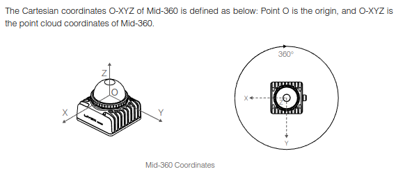
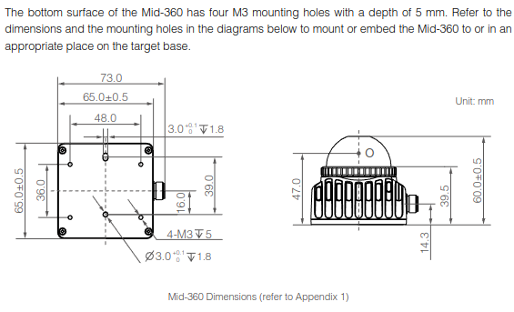
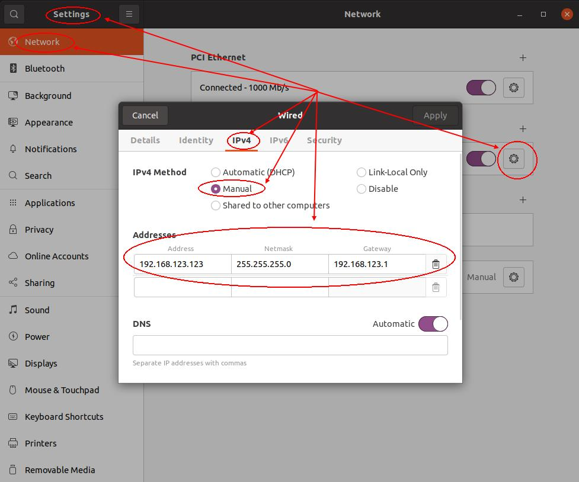
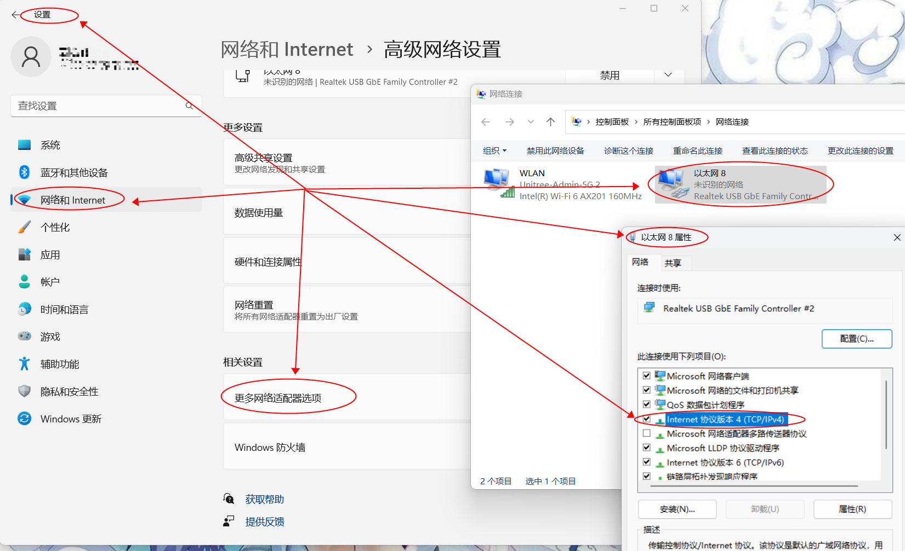
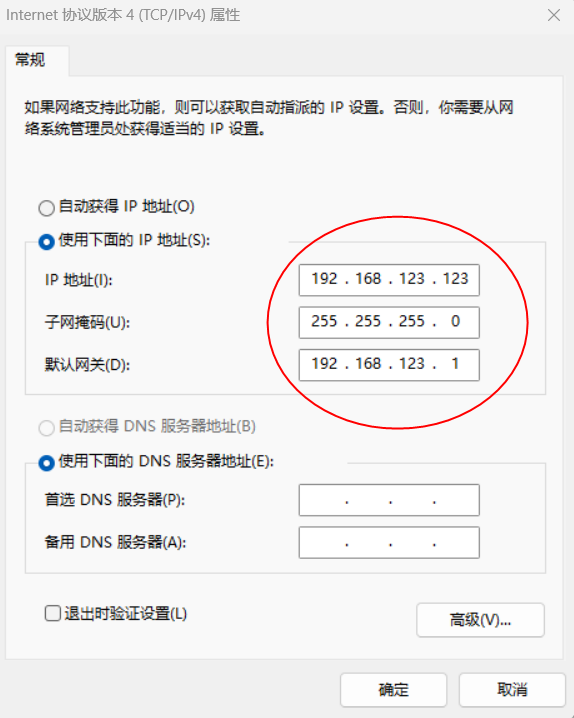
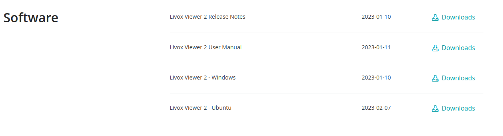
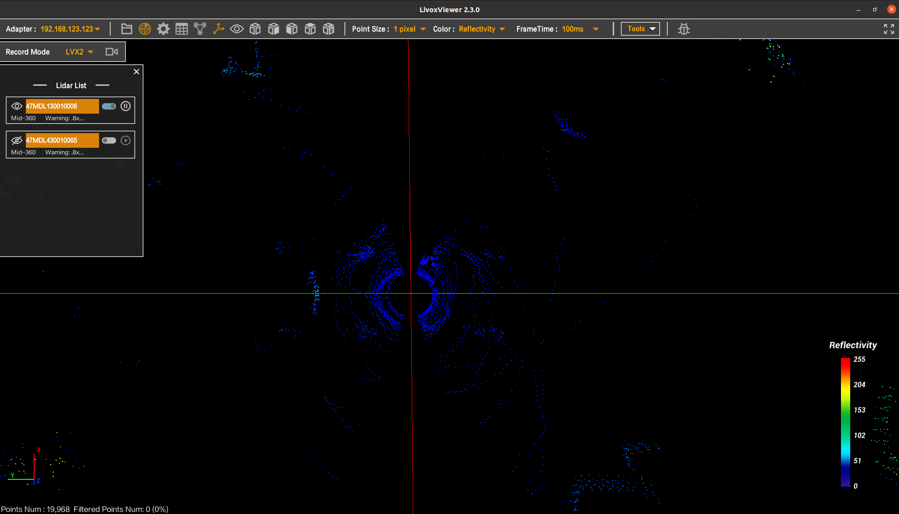
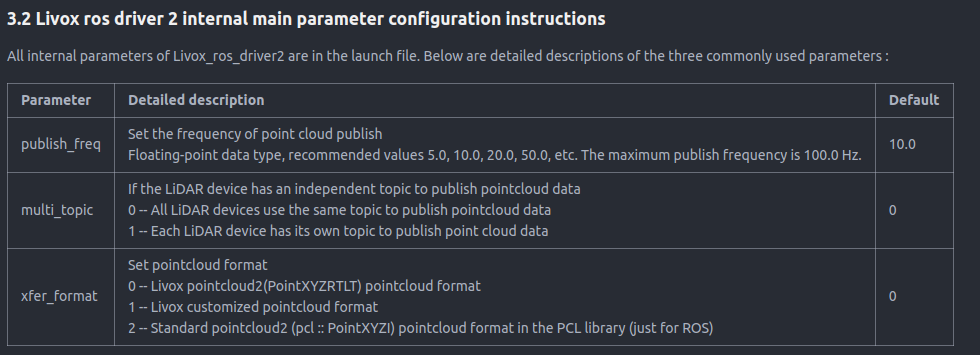

# Lidar Instructions

**Source:** https://support.unitree.com/home/en/G1_developer/lidar_Instructions  
**Scraped:** 10291.04635305

---

# 1\. G1 robot lidar introduction and official information acquisition

The G1 robot lidar is located in the head position, and the radar model is livox Mid-360.  
Livox Mid-360 is a cost-effective, safe and reliable laser detection rangefinder sensor, which can be widely used in logistics robots, industrial robots, smart cities and other fields, supporting the realization of mapping, positioning, identification, obstacle avoidance and other functions.  
Lidar details page: **<https://www.livoxtech.com/mid-360>**  
Lidar data page: **<https://www.livoxtech.com/mid-360/downloads>**  
Lidar's official github address: **<https://github.com/Livox-SDK>**  
Relationship between radar coordinate system, lidar coordinate system and robot central coordinate system:  
  

# 2\. Radar data acquisition

## 2.1 Communication connection

The factory ip address of the radar robot is set to `192.168.123.120`.  
Connect the computer to the robot through network cable, set the computer ip address to` 192.168.123` network segment, netmsak to `255.255.255.0`, gateway to `192.168.123.1`. You can run the ping `192.168.123.120` command to check whether the radar ip address is effectively connected.  
If the ubuntu OS is used, configure the ip address of the network port by referring to:  
  
If the windows OS is used, configure the ip address of the network port as follows:  
  

## 2.2 Livox Viewer 2 Host computer to obtain data livox provides a host computer that can directly view radar data and configure radar parameters.

Relevant data download address: <https://www.livoxtech.com/mid-360/downloads>  
  
If the hardware connection is normal, open the Livox Viewer 2 PC and you can see:  
  
For details about how to use the upper computer, see the 《Livox Viewer 2 User Manual》.

note

Running 'LivoxViewer2.sh' directly on the PC2 (Jetson Orin Nx) Ubuntu system will give an 'Exec format error'. It is recommended that you use your own PC to connect to the G1 shoulder network port to configure the radar IP and related parameters.

## 2.3 Obtain data through Livox-SDK2

The Livox SDK2 is a software development kit designed for all Livox LiDAR systems such as HAP and Mid-360. It is based on C/C++, follows the Livox SDK2 communication protocol, and provides an easy-to-use C-style API. With Livox SDK2, users can quickly connect to Livox LiDAR and receive point cloud data.  
Livox-SDK2 code repository address: **<https://github.com/Livox-SDK/Livox-SDK2>**

### Compilation and installation steps:
    
    
    git clone https://github.com/Livox-SDK/Livox-SDK2.git
    cd ./Livox-SDK2/
    mkdir build
    cd build
    cmake .. && make -j
    sudo make install

### Uninstall/Delete steps:
    
    
    sudo rm -rf /usr/local/lib/liblivox_lidar_sdk_*
    sudo rm -rf /usr/local/include/livox_lidar_*

Code routine reference... For the code samples in the `/Livox-SDK2/samples` folder, change "lidar_ip" to 192.168.123.120 and "host_ip" to the host ip in the mid360_config.json file.

## 2.4 Obtain data from livox_ros_driver2

Livox ROS Driver 2 is a second-generation driver package for LiDAR products that connect to Livox products, for ROS (noetic recommended) and ROS2 (foxy or humble recommended).  
livox_ros_driver2 Address of the code repository:  
**<https://github.com/Livox-SDK/livox_ros_driver2>**  
Compile and use readme file instructions for reference code.  
For G1 robot lidar, modifications are needed. The ip address of lidar_configs in `../livox_ros_driver2/config/MID360_config.json` file is **192.168.123.120** , and the ip address of host_net_info is the host ip address.

### Refer to the configuration file:
    
    
    {
      "lidar_summary_info" : {
        "lidar_type": 8
      },
      "MID360": {
        "lidar_net_info" : {
          "cmd_data_port": 56100,
          "push_msg_port": 56200,
          "point_data_port": 56300,
          "imu_data_port": 56400,
          "log_data_port": 56500
        },
        "host_net_info" : {
          "cmd_data_ip" : "192.168.123.123",
          "cmd_data_port": 56101,
          "push_msg_ip": "192.168.123.123",
          "push_msg_port": 56201,
          "point_data_ip": "192.168.123.123",
          "point_data_port": 56301,
          "imu_data_ip" : "192.168.123.123",
          "imu_data_port": 56401,
          "log_data_ip" : "",
          "log_data_port": 56501
        }
      },
      "lidar_configs" : [
        {
          "ip" : "192.168.123.120",
          "pcl_data_type" : 1,
          "pattern_mode" : 0,
          "extrinsic_parameter" : {
            "roll": 0.0,
            "pitch": 0.0,
            "yaw": 0.0,
            "x": 0,
            "y": 0,
            "z": 0
          }
        }
      ]
    }

Change the user_config_path parameter in the launch file to the path to the MID360_config.json configuration file.  
The contents of the `../livox_ros_driver2/launch_ROS1` file are used as an example:
    
    
    <launch>
    
    	<!--user configure parameters for ros start-->
    	<arg name="lvx_file_path" default="livox_test.lvx"/>
    	<arg name="bd_list" default="100000000000000"/>
    	<arg name="xfer_format" default="1"/>
    	<arg name="multi_topic" default="0"/>
    	<arg name="data_src" default="0"/>
    	<arg name="publish_freq" default="10.0"/>
    	<arg name="output_type" default="0"/>
    	<arg name="rviz_enable" default="false"/>
    	<arg name="rosbag_enable" default="false"/>
    	<arg name="cmdline_arg" default="$(arg bd_list)"/>
    	<arg name="msg_frame_id" default="livox_frame"/>
    	<arg name="lidar_bag" default="false"/>
    	<arg name="imu_bag" default="false"/>
    	<!--user configure parameters for ros end--> 
    
    	<param name="xfer_format" value="$(arg xfer_format)"/>
    	<param name="multi_topic" value="$(arg multi_topic)"/>
    	<param name="data_src" value="$(arg data_src)"/>
    	<param name="publish_freq" type="double" value="$(arg publish_freq)"/>
    	<param name="output_data_type" value="$(arg output_type)"/>
    	<param name="cmdline_str" type="string" value="$(arg bd_list)"/>
    	<param name="cmdline_file_path" type="string" value="$(arg lvx_file_path)"/>
    	<param name="user_config_path" type="string" value="$(find livox_ros_driver2)/config/MID360_config.json"/>
    	<param name="frame_id" type="string" value="$(arg msg_frame_id)"/>
    	<param name="enable_lidar_bag" type="bool" value="$(arg lidar_bag)"/>
    	<param name="enable_imu_bag" type="bool" value="$(arg imu_bag)"/>
    
    	<node name="livox_lidar_publisher2" pkg="livox_ros_driver2"
    	      type="livox_ros_driver2_node" required="true"
    	      output="screen" args="$(arg cmdline_arg)"/>
    
    	<group if="$(arg rosbag_enable)">
        	<node pkg="rosbag" type="record" name="record" output="screen"
              		args="-a"/>
        </group>
    
    </launch>

If the hardware connection is normal, you can subscribe to **`/livox/lidar`** , **`/livox/imu`** topics after roslaunch livox_ros_driver2 msg_MID360.launch.  
It should be noted that the format of the /livox/lidar topic is controlled by the xfer_format parameter of the launch file, see the readme file description of the code:  

# 3.noise processing

Reference: **<https://www.livoxtech.com/showcase/livox-tag>**  
Starting from the bottom information of LIDAR, Livox has built-in Tag information identifying the point cloud multiple echo and noise information data in the radar output point cloud data to help users deal with point cloud noise more efficiently.  

Reference code:
    
    
    // Only when all the lower four digits are 0 can it be used
    if(_Lidar_1_pcl.points[i].tag > 0 && _Lidar_1_pcl.points[i].tag < 16){
        // std::cout << "tag: " << static_cast<int>(_Lidar_1_pcl.points[i].tag) << std::endl;
    
        // std::vector<bool> bit_values(8);
        // // Extract each bit and store it as a Boolean value
        // for (int k = 0; k < 8; ++k) {
        //     bit_values[k] = (_Lidar_1_pcl.points[i].tag >> k) & 0x01;
        // }
    
        // // Output the Boolean value of each bit
        // for (int k = 0; k < 8; ++k) {
        //     std::cout << "Bit " << k << ": " << static_cast<bool>(bit_values[k]) << std::endl;
        // }
        continue;
    }
