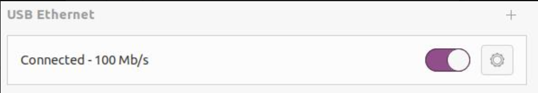

# Quick Development

**Source:** https://support.unitree.com/home/en/G1_developer/quick_development  
**Scraped:** 10153.951067495

---

This document provides a guide on how to quickly develop applications for the G1 robot using the [unitree_sdk2](https://github.com/unitreerobotics/unitree_sdk2).

## Environment Requirements

### System Requirements

Development is recommended on Ubuntu 20.04. Development on Mac and Windows systems is currently not supported. PC1 runs the official service and does not support development; PC2 can be accessed for development.

### Network Requirements

Connect the user computer and the G1 switch to the same network. New users are advised to connect the user computer to the G1 switch using a network cable and adapter, and configure the network card communicating with the robot to the 192.168.123.X subnet, preferably using 192.168.123.99. Experienced users can configure the network environment as needed.

## Installation and Compilation

### Installing unitree_sdk2

To install unitree_sdk2, navigate to the unitree_sdk2 directory and run the following commands:
    
    
    cd unitree_sdk2/
    mkdir build
    cd build
    cmake ..
    sudo make install

### Compiling the Included Examples

To compile the included examples, navigate to the unitree_sdk2 directory and execute the following commands:
    
    
    cd unitree_sdk2
    mkdir build
    cd build
    cmake ..
    make

If successful, the compiled examples will be located in the `unitree_sdk2/build` directory.

### Modifying Network Configuration

Configuration steps:

  1. Connect one end of a network cable to the robot and the other end to the user's computer. Enable USB Ethernet on the computer and configure it. The robot's onboard computer IP address is `192.168.123.161`, so set the computer's USB Ethernet address to the same subnet, such as `192.168.123.222`.

 

To test if the user computer and the robot's onboard computer are properly connected, enter `ping 192.168.123.161` in the terminal. A similar output to the image below indicates a successful connection.

  2. Identify the network card name corresponding to the 123 subnet using the `ifconfig` command, as shown below:

The network card name corresponding to IP `192.168.123.222` is `enxf8e43b808e06`. Note this name as it will be required when running examples.

## Running Examples

### Entering Debug Mode

Follow the [Quick Start Guide](https://support.unitree.com/home/en/G1_developer/quick_start) to ensure the robot is in debug mode.

### Compiling and Running the Low-Level Control Routine

> Note: Running this routine will move multiple joints of the G1. To protect the robot, please suspend the robot before running this routine.
    
    
    cd unitree_sdk2
    cmake -Bbuild 
    cmake --build build
    ./build/bin/g1_ankle_swing_example network_interface_name

For more details on the routine, refer to the [Basic Motion Routine](https://support.unitree.com/home/en/G1_developer/basic_motion_routine).
