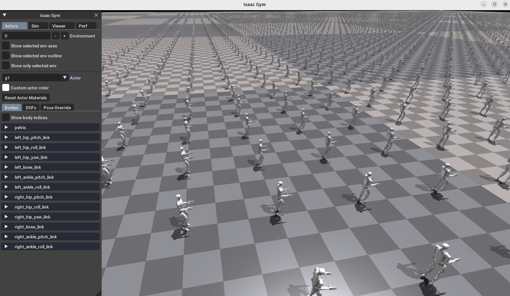
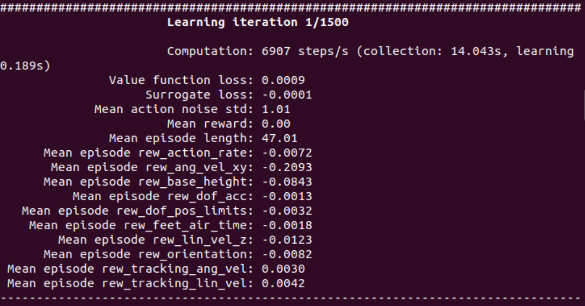

# Rl Control Routine

**Source:** https://support.unitree.com/home/en/G1_developer/rl_control_routine  
**Scraped:** 10276.407887175

---

This document will provide a simple example of reinforcement learning controlling G1. The following describes how to use the **isaac_gym** simulation platform to train the G1 control algorithm.

# Hardware preparation

Since the isaac_gym simulation platform requires `CUDA`, this article recommends that the hardware needs to be configured with an NVIDIA graphics card (video memory >8GB, RTX series graphics card) and the corresponding graphics card driver installed. It is recommended that the system use `ubuntu18/20`, graphics card driver version 525

# Environment configuration

It is recommended to configure this environment in a virtual environment `conda`.

  1. Create a virtual environment

    
    
    conda create -n rl-g1 python=3.8

  2. Activate virtual environment

    
    
    conda activate rl-g1

  3. Install `CUDA`， `pytorch`

    
    
    pip3 install torch==1.10.0+cu113 torchvision==0.11.1+cu113 torchaudio==0.10.0+cu113 -f https://download.pytorch.org/whl/cu113/torch_stable.html

> Note that the numpy library version should not be too high. It is recommended to install version 1.23.5.

  4. Download the [Isaac Gym Preview 4](https://developer.nvidia.com/isaac-gym) simulation platform, unzip it and enter the `python` directory, and use `pip` to install it.

    
    
    # current directory: isaacgym/python
    pip install -e .

  5. Run the routines in the `python/examples` directory to verify whether the installation is successful.

    
    
    # current directory: isaacgym/python/examples
    python 1080_balls_of_solitude.py

If the installation is successful, you will see the following window.

  
6\. Install `rsl_rl` library (use v1.0.2)
    
    
    git clone https://github.com/leggedrobotics/rsl_rl
    cd rsl_rl
    git checkout v1.0.2
    pip install -e .

# Model training usage

  1. Download Unitree official sample code

    
    
    git clone https://github.com/unitreerobotics/unitree_rl_gym.git

  2. Modify `legged_gym/scripts/train.py` and `sys.path.append("/home/unitree/h1/legged_gym")` in `legged_gym/scripts/play.py`  
Make your own path.
  3. Activate the reinforcement learning virtual environment

    
    
    conda activate rl-g1

  4. Switch to the `legged_gym/scripts` directory, execute the training instructions, and start training.

    
    
    python3  train.py --task=g1

Modify the `args.headless` parameter in the train.py file to turn on or off the visual interface.

isaac_gym When the following interface appears, training begins.

The terminal output window is as follows:

After training 1500 times, run the test instructions.
    
    
    python play.py --task=g1

# Effect demonstration
