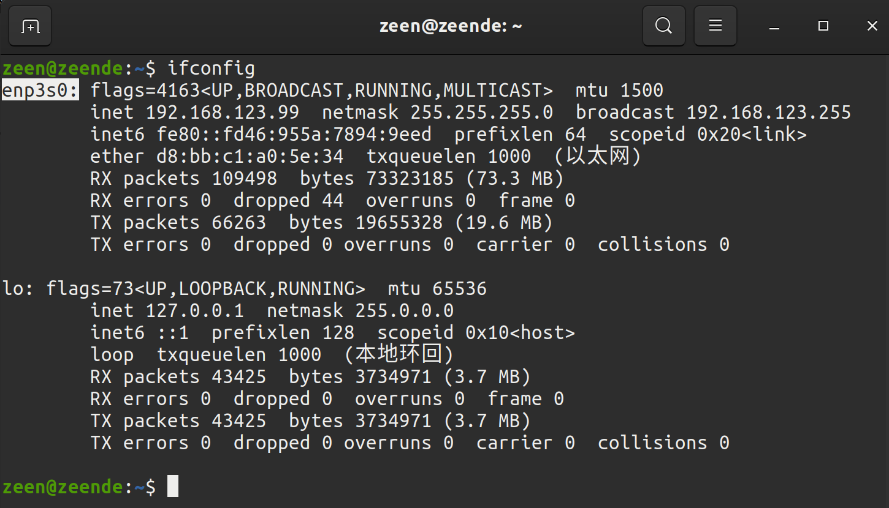

# Ros2 Communication Routine

**Source:** https://support.unitree.com/home/en/G1_developer/ros2_communication_routine  
**Scraped:** 10281.320269946

---

# Introduction

[**unitree_sdk2**](https://github.com/unitreerobotics/unitree_sdk2) implements an easy-to-use robot communication mechanism based on Cyclonedds, which enable developers to achieve robot communication and control (**Supports Unitree Go2, B2, H1,and G1**).

DDS is alos used in ROS2 as a communication mechanism. Therefore, the underlying layers of Unitree H1, B2, and G1 robots can be compatible with ROS2. ROS2 msg can be direct used for communication and control of Unitree robot without wrapping the SDK interface.

# Configuration

## System requirements

Tested systems and ROS2 distro

systems | ROS2 distro  
---|---  
Ubuntu 20.04 | foxy  
Ubuntu 22.04 | humble  
  
Taking ROS2 foxy as an example, if you need another version of ROS2, replace "foxy" with the current ROS2 version name in the corresponding place.

note

There may be differences in the APIs of different versions of ROS2, such as rosbag. The examples in the repository are developed under ROS2 Foxy. If using other ROS2 distributions, please refer to the official documentation for adjustments.

The installation of ROS2 foxy can refer to: <https://docs.ros.org/en/foxy/Installation/Ubuntu-Install-Debians.html>

ctrl+alt+T open the terminal, clone the repository: <https://github.com/unitreerobotics/unitree_ros2>
    
    
    git clone https://github.com/unitreerobotics/unitree_ros2

where:

  * **cyclonedds_ws** : The workspace of Unitree ros2 package. The msg for Unitree robot are supplied in the subfolder cyclonedds_ws/unitree/unitree_go and cyclonedds_ ws/unitree/unitree_api.

## Install Unitree ROS2 package

### 1\. Dependencies
    
    
    sudo apt install ros-foxy-rmw-cyclonedds-cpp
    sudo apt install ros-foxy-rosidl-generator-dds-idl

For the convenience of using the interface, it is recommended to install unitree_sdk2 <https://github.com/unitreerobotics/unitree_sdk2>

### 2\. Compile cyclone dds

The cyclonedds version of Unitree robot is 0.10.2. To communicate with Unitree robots using ROS2, it is necessary to change the dds implementation. See：https://docs.ros.org/en/foxy/Concepts/About-Different-Middleware-Vendors.html

Before compiling cyclonedds, please ensure that ros2 environment has **NOT** been sourced when starting the terminal. Otherwise, it may cause errors in compilation.

If "source/opt/ros/foxy/setup. bash" has been added to the ~/.bashrc file when installing ROS2, it needs to be commented out:
    
    
    sudo apt install gedit
    sudo gedit ~/.bashrc
    
    
    # source /opt/ros/foxy/setup.bash 

Compile cyclone-dds
    
    
    cd ~/unitree_ros2/cyclonedds_ws/src
    git clone https://github.com/ros2/rmw_cyclonedds -b foxy
    git clone https://github.com/eclipse-cyclonedds/cyclonedds -b releases/0.10.x 
    cd ..
    colcon build --packages-select cyclonedds #Compile cyclone-dds package

### 3\. Compile unitree_go and unitree_api packages

After compiling cyclone-dds, ROS2 dependencies is required for compilation of the unitree_go and unitree_api packages. Therefore, before compiling, it is necessary to source the environment of ROS2.
    
    
    source /opt/ros/foxy/setup.bash # source ROS2 environment
    colcon build # Compile all packages in the workspace

## Connect to Unitree robot

### 1\. Network configuration

Connect Unitree robot and the computer using Ethernet cable. Then, use ifconfig to view the network interface that the robot connected. For example, "enp3s0" in the following figure.  

Next, open the network settings, find the network interface that the robot connected.In IPv4 setting, change the IPv4 mode to manual, set the address to 192.168.123.99, and set the mask to 255.255.255.0. After completion, click apply and wait for the network to reconnect.  

Open setup.sh file.
    
    
    sudo gedit ~/unitree_ros2/setup.sh
    
    
    #!/bin/bash
    echo "Setup unitree ros2 environment"
    source /opt/ros/foxy/setup.bash
    source $HOME/unitree_ros2/cyclonedds_ws/install/setup.bash
    export RMW_IMPLEMENTATION=rmw_cyclonedds_cpp
    export CYCLONEDDS_URI='<CycloneDDS><Domain><General><Interfaces>
                                <NetworkInterface name="enp3s0" priority="default" multicast="default" />
                            </Interfaces></General></Domain></CycloneDDS>'

where "enp3s0" is the network interface name of unitree robot connected.  
Modify it to the corresponding network interface according to the actual situation.

Source the environment to setup the ROS2 support of Unitree robot:
    
    
    source ~/unitree_ros2/setup.sh

If you don't want to source the bash script every time when a new terminal opens, you can write the content of bash script into ~/.bashrc, but attention should be paid when there are multiple ROS environments coexisting in the system.

### 2\. Connect and test

After completing the above configuration, it is recommended to restart the computer before conducting the test.

Ensure that the network of robot is connected correctly, open a terminal and input:
    
    
    source ~/unitree_ros2/setup.sh
    ros2 topic list

You can see the following topics:  

