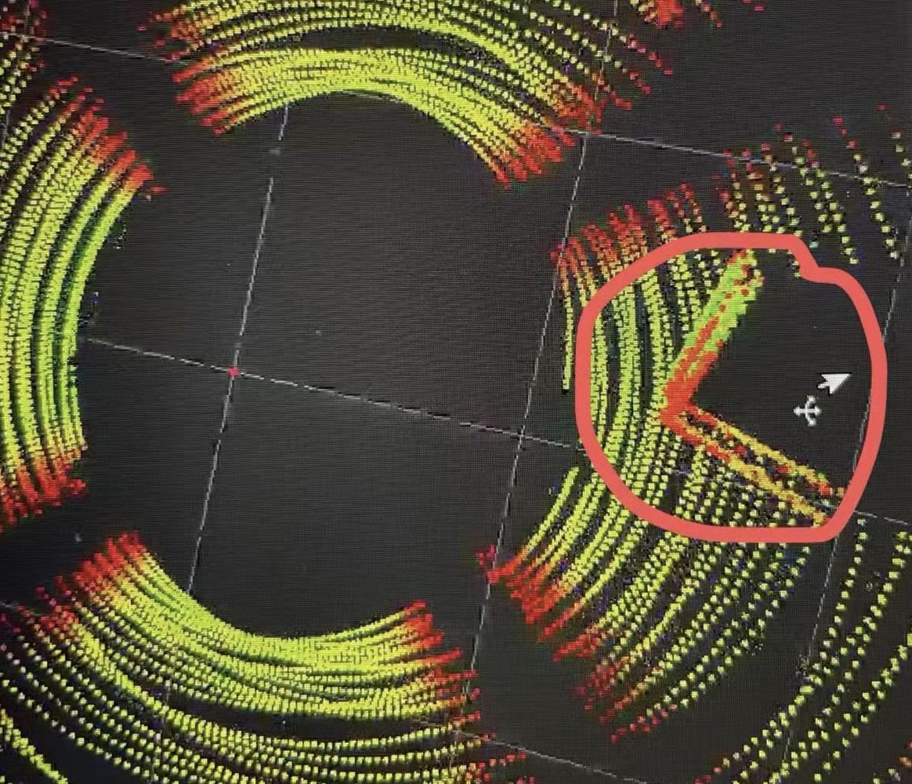
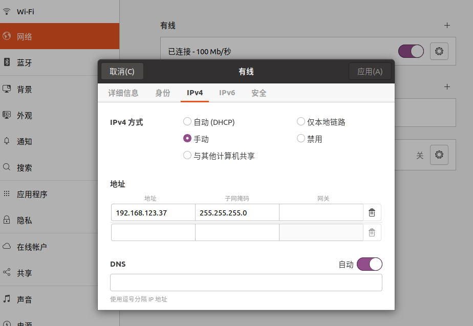
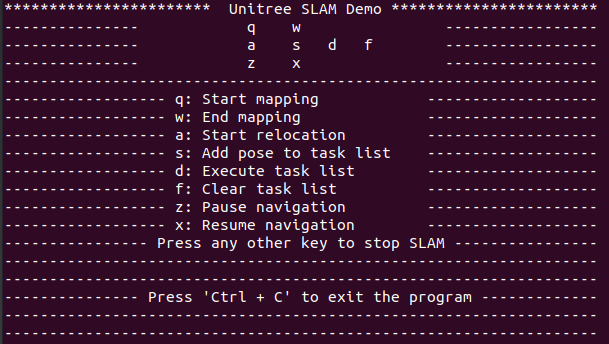

# Slam Navigation Services Interface

**Source:** https://support.unitree.com/home/en/G1_developer/slam_navigation_services_interface  
**Scraped:** 10241.414306013

---

# SLAM navigation service interface

## 1\. Introduction

The interface of SLAM and navigation service is based on unitree sdk2 for interface calling. Before using, please ensure that you are in the same LAN segment as the robot, and confirm that the unitree_slam and lidar_driver services of G1 are turned on through the App. When using the interface calling, please do not use the navigation function on the App at the same time. The client can realize basic SLAM and navigation functions by configuring different api-ids and subscribing to different topic data.

The origin of the coordinate system of the point cloud and positioning information output by slam is the origin of the Mid360-IMU coordinate system. The positive direction of the X axis is directly in front of the robot, and the positive direction of the Z axis is vertically upward. For details of the Mid360 coordinate system, please refer to the LIDAR service interface.

Applicable scenarios and scope: `static indoor flat scenes` with `rich features` and `X-axis/Y-axis of less than 45m`. (Large-scale maps take up more computing resources. In order not to affect basic operation and control services, please do not exceed the recommended range.) Violent movements may cause loss of positioning, please avoid violent movements of the robot when using this interface.

This function is suitable for the education and scientific research industries and is not recommended for industrial applications. Please contact sales for industrial applications.

Note: Before use, please check for any abnormalities in the raw lidar point clouds and IMU data before use, and the head is fixed vertically upward without looseness. If the front and rear point cloud data frames are obviously stratified when the lidar illuminates the same static vertical plane in a static state, or the IMU linear velocity and acceleration values are significantly abnormal, please contact sales for lidar repair.  
The point clouds data topic name is:rt/utlidar/cloud_livox_mid360  
The imu data topic name is:rt/utlidar/imu_livox_mid360

## 2\. Network configuration

The default IP address of the NX development board is 192.168.123.164. Users can access the local area network through a direct network cable. The lidar IP address used in this service is: 192.168.123.120. Please make sure that the lidar IP address is correct before use. The network check steps are as follows:

  1. After the user's PC is directly connected to the G1 internal switch via an Ethernet cable, change the local IP address to 192.168.123.XXX (the XXX setting value should not conflict with the existing IP).  

  2. Open the terminal and enter the following commands to check whether the communication is successfully connected.

    
    
    ssh unitree@192.168.123.164 # Enter the NX , the initial password is: 123
    
    ping 192.168.123.120 #Lidar IP address
    
    ping 192.168.123.161 #PC1 IP address

## 3\. Service Data Description

Service name and version: SERVICE_NAME = "slam_operate", VERSION = "1.0.0.1"  
Currently, the open interfaces api-id: 1801 start mapping, 1802 end mapping, 1804 initialize pose, 1102 pose navigation, 1201 pause navigation, 1202 resume navigation, 1901 close slam. The service request parameters and feedback data formats are both Json, and the specific parameters are as follows:  
1.start mapping
    
    
    api id: 1801
    
    input parameters:
    {
      "data": {
          "slam_type": "indoor" #fixed value
        }
    }
    
    feedback data:
    {
        "succeed":true, #Whether the execution was successful or not
        "errorCode":0,  #Error code, 0 means normal
        "info":"",      #Description information
        "data":{}       #Rest of data
    }

2.end mapping
    
    
    api id: 1802
    
    input parameters:
    {
      "data": {
          "address": "/home/unitree/test.pcd" #Pcd save address
        }
    }
    
    feedback data:
    {
        "succeed":true, #Whether the execution was successful or not
        "errorCode":0,  #Error code, 0 means normal
        "info":"",      #Description information
        "data":{}       #Rest of data
    }

`Note`：  
To prevent multiple pcd map files from occupying too much disk space, it is recommended to unify the file names as `test1.pcd~test10.pcd`, overwrite the saved map pcd data.

3.initialize pose
    
    
    api id: 1804
    
    input parameters:
    {
      "data": {
            "x": 0.0,    #Translation information
            "y": 0.0,
            "z": 0.0,
            "q_x": 0.0,  #Rotation information
            "q_y": 0.0,
            "q_z": 0.0,
            "q_w": 1.0,
            "address": "/home/unitree/test.pcd" #Pcd load address
        }
    }
    
    feedback data:
    {
        "succeed":true, #Whether the execution was successful or not
        "errorCode":0,  #Error code, 0 means normal
        "info":"",      #Description information
        "data":{}       #Rest of data
    }

4.pose navigation
    
    
    api id: 1102
    
    input parameters:
    {
      "data": {
           "targetPose": {  
              "x": 2.0,    #Target pose information
              "y": 0.0,
              "z": 0.0,
              "q_x": 0.0,
              "q_y": 0.0,
              "q_z": 0.0,
              "q_w": 1.0
            },
            "mode":1      #Fixed value
        }
    }
    
    feedback data:
    {
        "succeed":true, #Whether the execution was successful or not
        "errorCode":0,  #Error code, 0 means normal
        "info":"",      #Description information
        "data":{}       #Rest of data
    }

`Note`:  
The distance between the target point and the current position cannot exceed `10 meters`. The robot will move in a straight line. Due to the radar's field of view, obstacles should be no less than `50 cm` high.  
5.pause navigation
    
    
    api id: 1201
    
    input parameters:
    {
      "data": {
        }
    }
    
    feedback data:
    {
        "succeed":true, #Whether the execution was successful or not
        "errorCode":0,  #Error code, 0 means normal
        "info":"",      #Description information
        "data":{}       #Rest of data
    }

6.resume navigation
    
    
    api id: 1202
    
    input parameters:
    {
      "data": {
        }
    }
    
    feedback data:
    {
        "succeed":true, #Whether the execution was successful or not
        "errorCode":0,  #Error code, 0 means normal
        "info":"",      #Description information
        "data":{}       #Rest of data
    }

7.close slam
    
    
    api id: 1901
    
    input parameters:
    {
      "data": {
        }
    }
    
    feedback data:
    {
        "succeed":true, #Whether the execution was successful or not
        "errorCode":0,  #Error code, 0 means normal
        "info":"",      #Description information
        "data":{}       #Rest of data
    }

## 4\. Topic Data Description

1.Real-time point cloud data for mapping. Topic: rt/unitree/slam_mapping/points Data type: sensor_msgs::msg::dds_::PointCloud2_

2.Real-time odom data for mapping. Topic: rt/unitree/slam_mapping/odom Data type: nav_msgs::msg::dds_::Odometry_

3.Relocation real-time point cloud data. Topic: rt/unitree/slam_relocation/points Data type: sensor_msgs::msg::dds_::PointCloud2_

4.Relocation real-time odom data. Topic: rt/unitree/slam_relocation/odom Data type: nav_msgs::msg::dds_::Odometry_

5.Real-time broadcast information. Topic: rt/slam_info Data type: std_msgs::msg::dds_::String_

6.Implementation status feedback. Topic: rt/slam_key_info Data type: std_msgs::msg::dds_::String_

7.Global map point cloud data topic (only sent once after start relocation, users can obtain map data by subscribing to this topic). Topic: rt/unitree/slam_relocation/global_map Data type: sensor_msgs::msg::dds_::PointCloud2_

The data in real-time broadcast information and execution status feedback information are all in Json format and can be judged and obtained through different fields, as follows:  
① Real-time broadcast information type (rt/slam_info): basic status information
    
    
    {
        "type": "robot_data",  #Data type
        "errorCode":0,         #Error code, 0 means normal
        "sec": 123456789,      #Timestamp
        "nanosec": 987654321,
        "info":XXX,            #Description information
        "data":{
            "motorTemp": [30.5,30.5,...],   #Motor temperature (unit: °C)
            "motorError": [0,0,0,...],      #Motor error code
            "batteryAmp": 1000.5,           #Battery current value (unit: mA)
            "batteryPower":10.0,            #Battery percentage (unit %)
            "batteryTemp":30.5,             #Battery temperature (unit: °C)
            "batteryVol":1000.5,            #Battery voltage (unit: mV)
            "sportMode":-1,                 #Sport mode, temporarily unavailable
            "gaitType":-1,                  #gait type, temporarily unavailable
            "cpuTemp":30.5,                 #Average temperature of CPU core (unit: ° C)
            "cpuUsage":30.5,                #CPU core occupancy rate (unit:%)
            "cpuMemory":30.5,               #Memory usage rate (unit:%)
            "cpuFrequency":100.5            #CPU average core frequency (unit:MHz)
        }
    }

②Real-time broadcast information type (rt/slam_info): relocation information
    
    
    {
        "type": "pos_info",  #Data type pos_info or mapping_info
        "errorCode":0,       #Error code, 0 means normal
        "sec": 123456789,    #Timestamp
        "nanosec": 987654321,
        "info":XXX,          #Description information
        "data":
          {
            "currentPose": { #Pose
              "x": 1.5,      
              "y": 1.5,
              "z": 1.5,
              "q_x": 0.0,
              "q_y": 0.0,
              "q_z": 0.0,
              "q_w": 1.0
              },
             "pcdName": "test"                    #Pcd name
             "address": "/home/unitree/test.pcd"  #Pcd address
          }
    }

③ Real-time broadcast information type (rt/slam_info): control information
    
    
    {
       "type": "ctrl_info", #Data type
        "errorCode":0,      #Error code, 0 means normal
        "sec": 123456789,   #Timestamp
        "nanosec": 987654321,
        "info":"XXX",       #Description information
        "data":
        {
          "targetNodeName": 9999,
          "is_arrived": false,
          "startPose": {
            "x": 1.1,
            "y": 1.2,
            "z": 1.3,
            "roll": 0.0,
            "pitch": 0.0,
            "yaw": 1.2
          },
          "targetPose": {
            "x": 1.1,
            "y": 1.2,
            "z": 1.3,
            "roll": 0.0,
            "pitch": 0.0,
            "yaw": 1.2
          },
          "stateMachine": {
            "state":"follow",      
            "isOpenPlan":false,    
            "isBack":false,       
            "isClimbStairs":false, 
            "isRotate":false,      
            "isPause":false,       # Whether to pause
            "ctrName":"pid",       
            "vx": 1.1,
            "vy": 1.2,
            "vyaw": 1.3
          },
          "obsInfo":{
            "state":false,         # Obstacles
            "time":0,              # Accumulated time (s)
          },
          "progress": {
            "used_time": 12.3,
            "last_time": 23.3,
            "completion_percentage": 0.12
          }
        }
    }

④Execution feedback information (rt/slam_key_info): single task execution feedback
    
    
    {
       "type": "task_result",     #Data type
        "errorCode":0,            #Error code, 0 means normal
        "sec": 123456789,         #Timestamp
        "nanosec": 987654321,
        "info":"XXX",             #Description information
        "data":
        {
          "targetNodeName": 9999, #Target
          "is_arrived": false     #Arrived
        }
    }

## 5\. Example test

Preparation:  
(1) Install unitree sdk2 in NX or personal PC. Download address:  
[unitree_sdk2 ](https://github.com/unitreerobotics/unitree_sdk2)  
(2) Download and compile the example program. Download address:  
[unitree_slam_example ](https://oss-global-cdn.unitree.com/static/dd442abf94ec44f599095cb15c3e298b.zip)
    
    
    cd /youFileAddress
    mkdir build
    cd build
    cmake ..
    make
    
    ./keyDemo eth0  #eth0:The name of the network card with network segment 123

