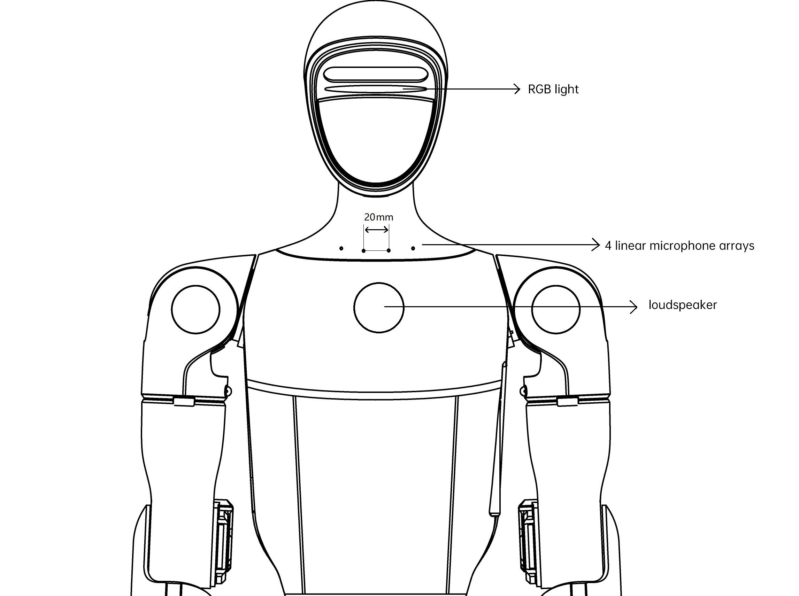

# Voice Assistant Instructions

**Source:** https://support.unitree.com/home/en/G1_developer/voice_assistant_instructions  
**Scraped:** 10122.608145844

---

The GPT model (firmware version ≥1.3.0) has been connected to the G1 device. `After connecting to the Internet`, the voice assistant dialogue mode is opened, and the device can support voice dialogue based on the GPT model (such as chat, action, music playback, etc.).

Component Location

## Pattern description

The G1 supports two conversation modes: `Wake up Conversation mode` and `push button conversation mode`.

#### Switching mode:

  * Remote control: press `L1+L2` at the same time
  * APP: 【Device】-【Data】-【Audio】-【Voice assistant】

Note!!!

  * All modes support `L2+Select` button wake up, `L1+Select` forced interrupt.
  * The blue light will breathe when you hear the voice, and the green light will breathe after you receive the instruction.

### Wake up mode:

**Wake-up Word** : "`Hello Robot`"

**Features** : Multiple rounds of natural dialogue can be conducted after awakening. It is suitable for quiet conversations.

**Introduction** : Wake up with "`Hello Robot`", wake up successfully, the robot will reply, then can carry out multiple rounds of unlimited free dialogue, timeout 15 seconds no sound after the dialogue ends, need to wake up again.

### Press button mode:

**Features** : Force a speech recognition, suitable for noisy environment.

**Introduction** : No wake word is required, while long press `L2+Select` to start recording, release `L2+Select` to end recording. The sound generated at this stage is forcibly identified and fed to a speech recognition framework.

## Close the interaction

The program sleeps, stops recording, and shuts down without privacy concerns.

### Methods to improve the recognition success rate:

● **Important** : There will be a breathing light flashing when the microphone is normal, please make good use of this light to assist. (If the lights don't flash while you're talking, you're not getting the sound. At this point, you need to get closer + check mode + check hardware).

● Stand right in front (microphone opening direction) and try within 1m distance.

● Speakers when playing sound, such as telling a story, playing music. At this time, the voice interaction effect is not good, you need to wait for the playback to complete before the next command, or press 'L1+Select' at the same time to interrupt.

### Troubleshooting:

#### 1\. Check whether the GPT is available

You can press `L2+Select` to wake up once, if the GPT is not connected to the network, it will reply "Hello, I am here", that is, enter the offline voice interaction mode.

#### 2\. Some questions are unresponsive or delayed.

Check whether GPT is available or if some of the questions triggered the Internet search (such as asking "What's the weather today") are related to the network environment.
