# Waist Fastener

**Source:** https://support.unitree.com/home/en/G1_developer/waist_fastener  
**Scraped:** 10117.368558103

---

# Background on Waist Fastener

G1-EDU fuselage 29 degrees of freedom version, waist has three degrees of freedom, for most users, the control will be difficult. To this end, Unitree provides you with a waist fastener. When you do not need to control the two waist parallel joints, you can physically lock the two parallel motors through the waist fastener. At the same time, you should enable the waist motor lock function on the Unitree Explore APP. The details are as follows:

## Item List

Waist Fixing Part 1 | Waist Fixing Part 2 | M5 Screw * 2 | Internal hexagonal   
L-shaped wrench  
---|---|---|---  
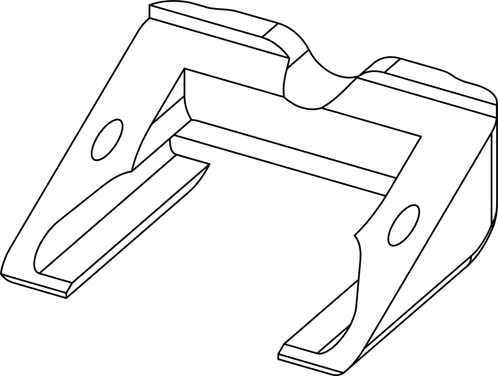 | 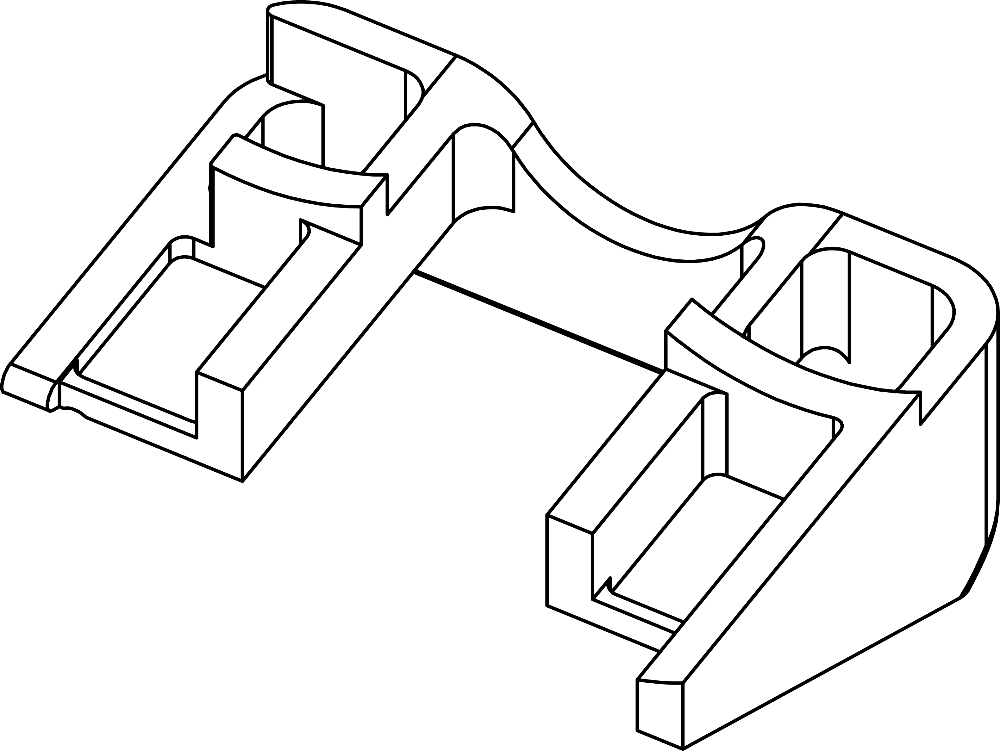 | 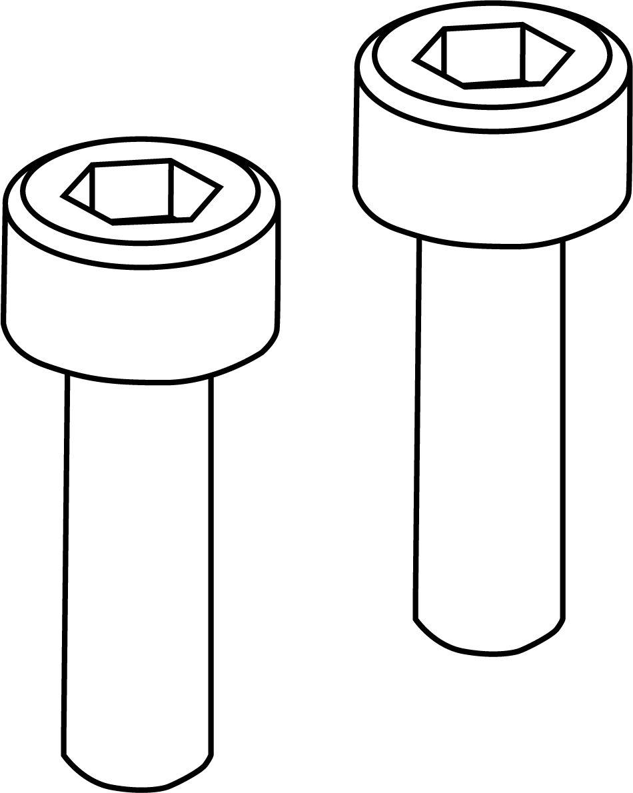 | 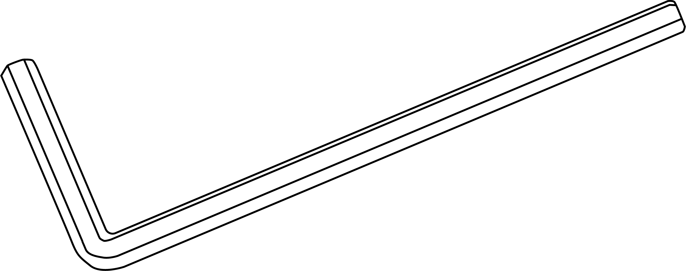  
  
## Installation Instructions

### Step1: Install the waist fixing part 1

First, turn the G1 body back and place the waist fixture 1 in the position shown in the figure.

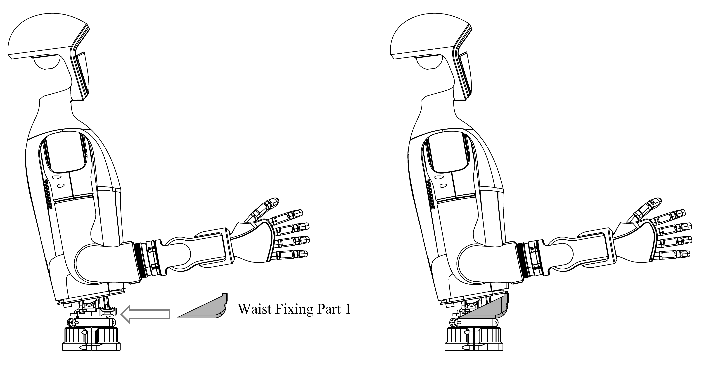

### Step2: Install the waist fixing part 2

After placing the waist fixture 1, turn the G1 body forward and place the waist fixture 2 in the position shown in the figure.

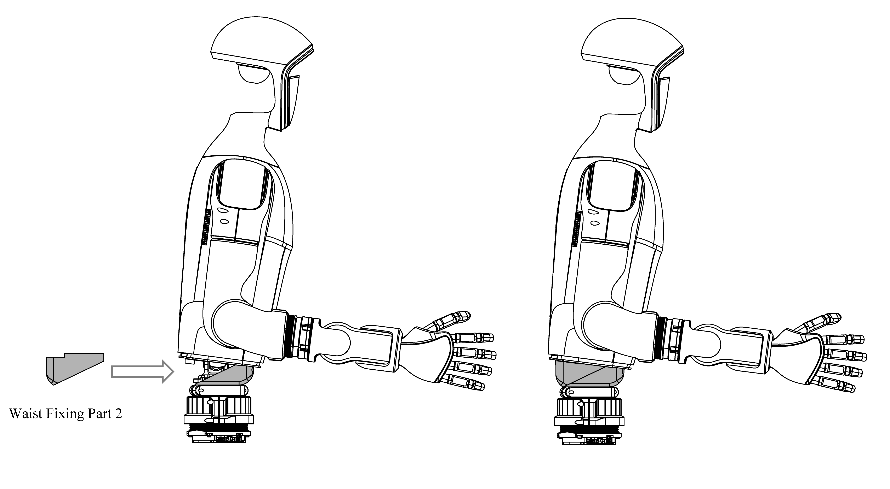

Attention!!! 

When installing the waist fastener, do not press on the waist cable to avoid damaging the cable and causing poor contact.

### Step3: Fix

Use an Allen wrench to secure the two M5 screws to the waist fixture, and then tighten them.

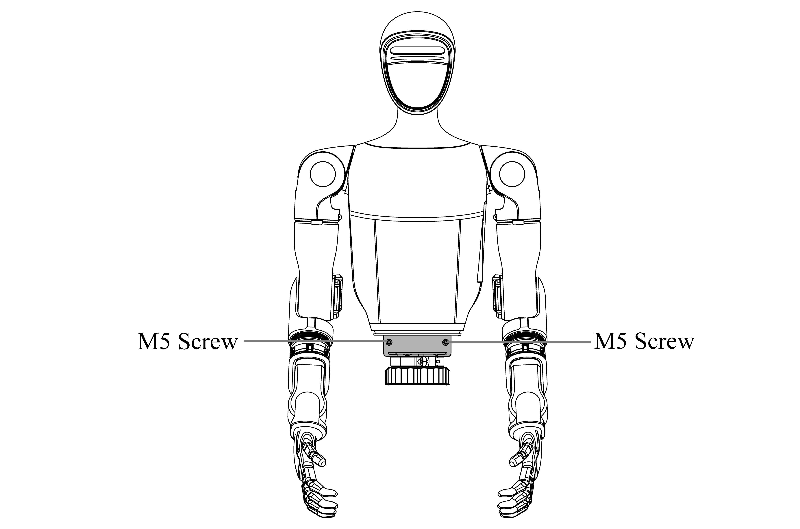

### Step4: Installation completed

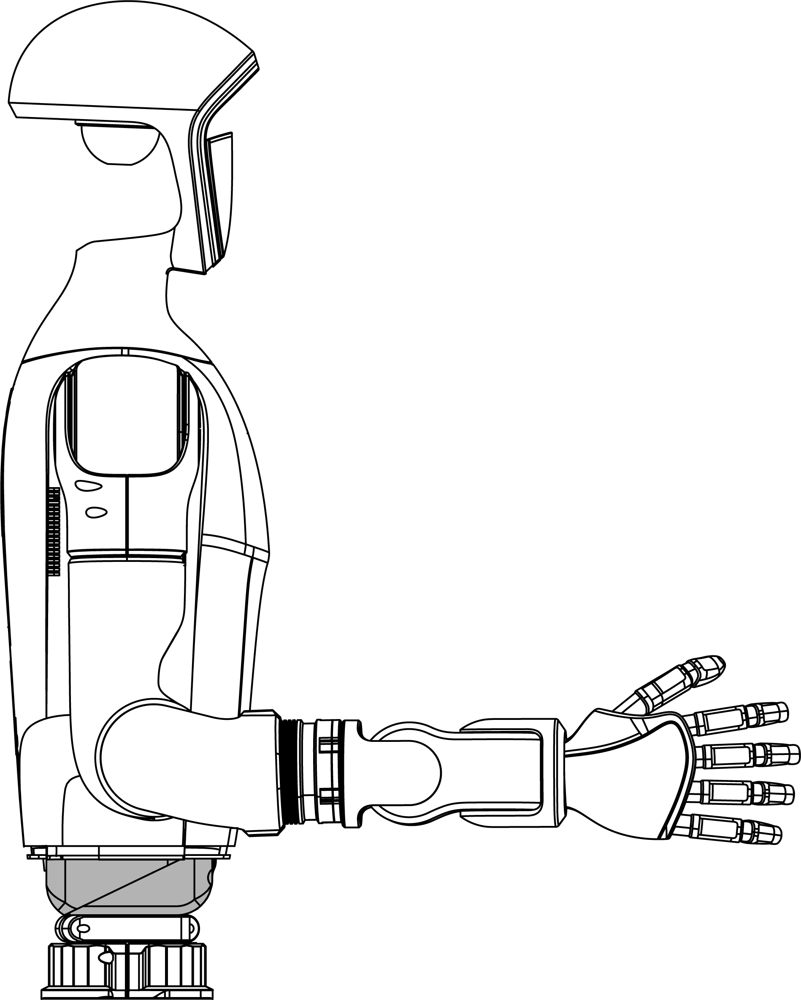

### Step5: Software Configuration

After the waist fixer is installed, you need to enable the waist motor locking function on the Unitree Explore APP [**Settings**] - [**Robot**], as shown below:

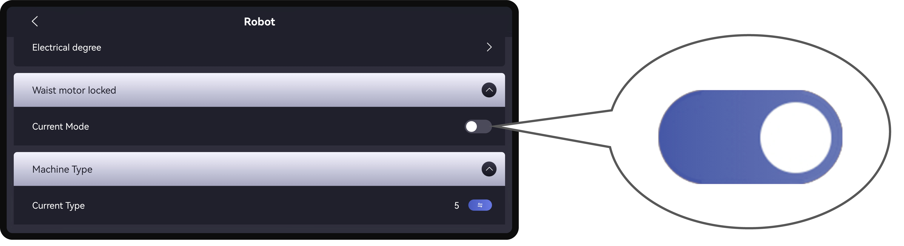

And restart the device according to the pop-up prompt.

## Disassembly Instructions

### Step1: Remove the waist fixing screw

Use an Allen wrench to remove the two M5 screws from the waist fixing.

### Step2: Remove the waist fixing part 2

Turn the G1 body forward and remove the waist fixture 2 as shown in the figure.

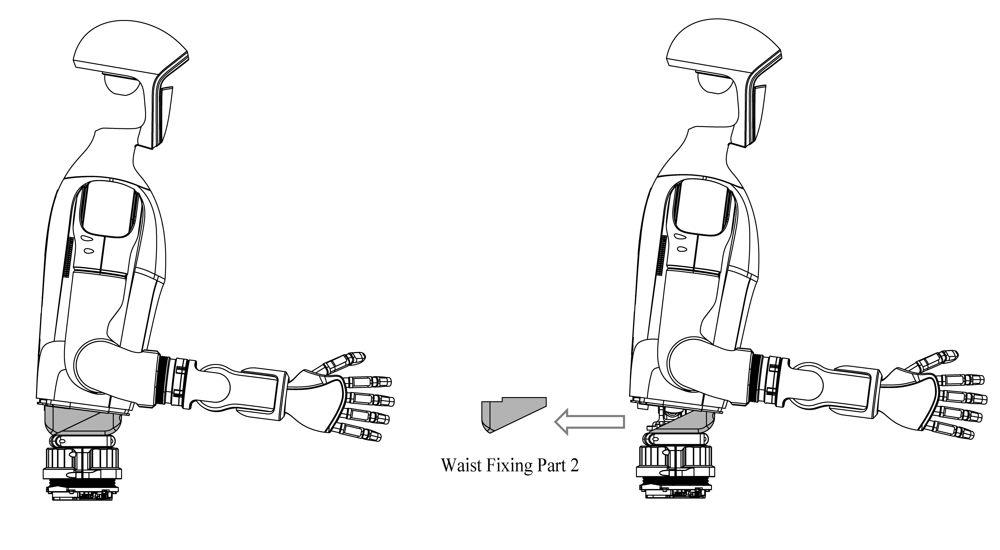

### Step3: Remove the waist fixing part 1

First, turn the G1 body backwards and remove the waist fixing part 1 according to the position shown in the figure.

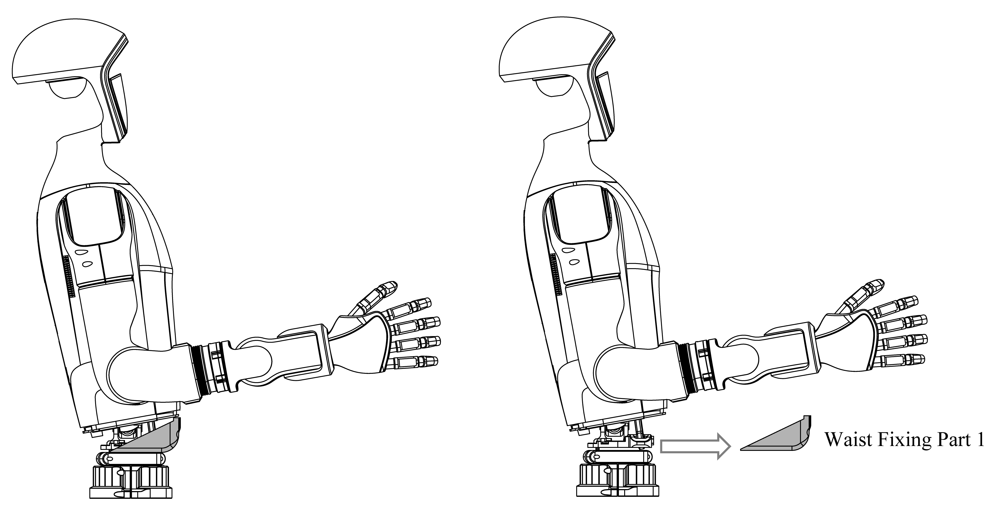

### Step4: Software Configuration

After disassembly, you need to turn off the waist motor locking function in the Unitree Explore APP [**Settings**] - [**Robot**], as shown in the following figure:

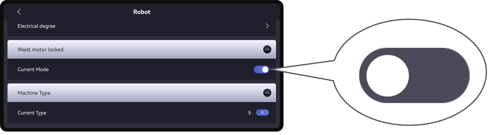

And restart the device according to the pop-up prompt.

note

**In the process of using the lock waist, if you have calibrated the 27-joint motor of the device, if you need to re-unlock the waist fixator , you need to re-calibrate the unlocked 29-joint motor after you have unlocked all the operations of the waist fixator.**
